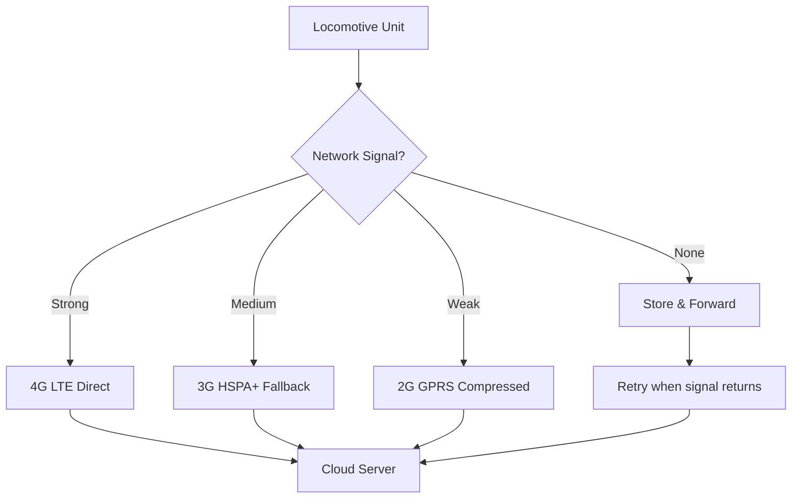

# South African Railway Locomotive GPS Tracking System
## Cellular-Only Implementation Guide (Variant 1)

---

## Executive Summary

**Project Goal:** Develop a straightforward, reliable GPS tracking system for locomotive fleet management across the South African rail network using proven cellular technology.

**Solution Approach:** LILYGO T-SIM7600G-H with 4G LTE communication, providing real-time location data through established cellular networks with comprehensive fallback capabilities.

**Total Investment:** R2,870 per unit hardware + R50/month operational costs

**Deployment Timeline:** 15 months for 100-unit rollout

---

## 1. Technical Requirements

### 1.1 Core Functionality
- **GPS Tracking:** Sub-5m accuracy with 1-minute update intervals
- **Data Transmission:** Real-time position reporting via cellular networks
- **Coverage:** 99%+ across SA rail network using multi-carrier approach
- **Power:** Operate on 110V locomotive power with 48-hour battery backup
- **Environmental:** -20°C to +70°C, IP67 rated, vibration resistant
- **Scalability:** Support 100+ units with centralized management

### 1.2 Communication Strategy
- **Primary:** 4G LTE (Cat-4, 150/50 Mbps)
- **Secondary:** 3G HSPA+ (42/11 Mbps fallback)
- **Tertiary:** 2G GPRS (universal coverage backup)
- **Data Protocol:** MQTT over TLS for secure transmission
- **Bandwidth:** 50MB/month per unit typical usage

### 1.3 Network Coverage by Region
- **Urban Areas:** 99%+ coverage (4G LTE on all networks)
- **Main Freight Lines:** 95%+ coverage (4G/3G)
- **Coal Routes:** 90%+ coverage (3G/2G fallback)
- **Iron Ore Line:** 85%+ coverage (2G GPRS minimum)
- **Branch Lines:** 80%+ coverage (2G with data compression)

---

## 2. Hardware Configuration

### 2.1 LILYGO T-SIM7600G-H Solution ✅ RECOMMENDED

| Component | Model | Unit Price (ZAR) | Quantity | Total | Purpose |
|-----------|--------|------------------|----------|--------|----------|
| **Main Board** | LILYGO T-SIM7600G-H | R1,500 | 1 | R1,500 | ESP32 + 4G LTE + GPS |
| **Antennas** | 4G/GPS Combo | R200 | 1 | R200 | Signal reception |
| **Power Supply** | Mean Well IRM-20-5 | R250 | 1 | R250 | 110VAC to 5VDC |
| **Backup Power** | 18650 Battery x2 | R120 | 1 | R120 | 48-hour backup |
| **Storage** | 32GB MicroSD | R120 | 1 | R120 | Local data logging |
| **Enclosure** | IP67 Junction Box | R350 | 1 | R350 | Environmental protection |
| **Mounting** | DIN Rail + Brackets | R50 | 1 | R50 | Secure installation |
| **Protection** | Surge/EMI Protection | R200 | 1 | R200 | Electrical safety |
| **Cables/Misc** | Connectors, wiring | R50 | 1 | R50 | Assembly |
| **TOTAL** | | | | **R2,870** | **Per unit cost** |

### 2.2 Why Cellular-Only is Optimal for Simplicity

**Advantages:**
- **Proven Technology:** Mature cellular networks with established coverage
- **Immediate Deployment:** No infrastructure development required
- **Real-time Capability:** Instant alerts and live tracking
- **Universal Coverage:** Works across all major SA cellular networks
- **Simple Integration:** Direct connection to existing IT infrastructure
- **Vendor Support:** Established support channels for cellular modules

**Network Compatibility:**
- **Vodacom:** Full 4G/3G/2G support on 900/1800/2100/2600 MHz
- **MTN:** Complete network compatibility with preferential IoT rates
- **Cell C:** Good coverage on main routes with competitive pricing
- **Telkom:** Growing 4G network with excellent pricing for IoT applications

---

## 3. Communication Architecture

### 3.1 Cellular Network Strategy



### 3.2 Multi-Carrier Approach

**Primary SIM Configuration:**
- **MTN Business IoT:** Primary carrier for reliability
- **Vodacom OneNet:** Secondary SIM for redundancy
- **Automatic failover:** Switch networks based on signal strength
- **Cost optimization:** Use least expensive network available

### 3.3 Data Transmission Optimization

**Adaptive Reporting Intervals:**
- **Stationary:** 10-minute intervals (depot/maintenance)
- **Moving <20km/h:** 5-minute intervals (yard operations)
- **Moving 20-60km/h:** 2-minute intervals (branch lines)
- **Moving >60km/h:** 1-minute intervals (main line operations)

**Data Compression:**
- **Delta encoding:** Only send position changes
- **Route optimization:** Reduce redundant straight-line points
- **Batch transmission:** Group multiple readings when possible
- **Emergency priority:** Immediate transmission for alerts

---

## 4. Software Architecture

### 4.1 Embedded Firmware (ESP32)

```cpp
class CellularTracker {
private:
    GPS gps;
    CellularModem cellular;
    SDLogger storage;
    PowerManager power;
    
public:
    void setup() {
        initializeHardware();
        establishCellularConnection();
        registerWithServer();
        startTracking();
    }
    
    void loop() {
        Position pos = gps.getCurrentPosition();
        
        // Always log locally first
        storage.logPosition(pos);
        
        // Attempt cellular transmission
        if (cellular.isConnected()) {
            if (transmitPosition(pos)) {
                storage.markAsSent(pos);
            } else {
                // Queue for retry
                storage.markForRetry(pos);
            }
        } else {
            // Attempt reconnection
            cellular.reconnect();
        }
        
        // Adaptive sleep based on movement
        uint32_t sleepTime = calculateSleepInterval(pos.speed);
        deepSleep(sleepTime);
    }
    
private:
    bool transmitPosition(Position pos) {
        MQTTMessage msg = createPositionMessage(pos);
        return cellular.publishMQTT(msg);
    }
    
    uint32_t calculateSleepInterval(float speed) {
        if (speed < 1.0) return 600000;      // 10 minutes stationary
        if (speed < 20.0) return 300000;     // 5 minutes slow
        if (speed < 60.0) return 120000;     // 2 minutes moderate
        return 60000;                        // 1 minute high speed
    }
};
```

### 4.2 Backend Infrastructure

**Core Components:**
- **MQTT Broker:** Eclipse Mosquitto or AWS IoT Core
- **Database:** MS SQL Server with spatial extensions
- **API Gateway:** .NET Core Web API
- **Real-time Updates:** SignalR for dashboard updates
- **Background Services:** Hangfire for data processing

**Database Schema:**
```sql
-- Core tables for cellular-only implementation
CREATE TABLE Locomotives (
    LocomotiveID INT PRIMARY KEY,
    DeviceIMEI NVARCHAR(20),
    CurrentCarrier NVARCHAR(20),
    LastSeen DATETIME2,
    IsOnline BIT
);

CREATE TABLE LocationHistory (
    ID BIGINT IDENTITY PRIMARY KEY,
    LocomotiveID INT,
    Timestamp DATETIME2,
    Location GEOGRAPHY,
    Speed FLOAT,
    Heading FLOAT,
    Carrier NVARCHAR(20),
    SignalStrength INT
);

CREATE TABLE NetworkEvents (
    EventID BIGINT IDENTITY PRIMARY KEY,
    LocomotiveID INT,
    Timestamp DATETIME2,
    EventType NVARCHAR(50), -- 'CONNECT', 'DISCONNECT', 'CARRIER_SWITCH'
    OldCarrier NVARCHAR(20),
    NewCarrier NVARCHAR(20),
    SignalStrength INT
);
```

---

## 5. Implementation Plan

### 5.1 Phase 1: Development & Testing (Months 1-5)
- **Scope:** Hardware prototyping, firmware development, initial testing
- **Resources:** 2 developers, 1 systems analyst
- **Objectives:** 
  - Complete T-SIM7600G-H integration and testing
  - Develop cellular communication firmware
  - Create basic backend services and database schema
  - Test multi-carrier functionality
- **Budget:** R25,000 hardware + R120,000 development costs
- **Success Criteria:** Reliable GPS tracking, successful cellular transmission, basic dashboard

### 5.2 Phase 2: Field Validation (Months 6-10)
- **Scope:** Extended field trials, system optimization, integration
- **Resources:** 2 developers, 1 network engineer, 1 field technician
- **Objectives:** 
  - Deploy 15 units across different route types for coverage validation
  - Optimize data usage and transmission strategies
  - Complete backend integration with existing railway systems
  - Validate multi-carrier failover functionality
- **Budget:** R60,000 hardware + R150,000 development/testing costs
- **Success Criteria:** 99% uptime, comprehensive coverage validation, optimized data usage

### 5.3 Phase 3: Production Deployment (Months 11-15)
- **Scope:** Full fleet rollout and operational handover
- **Resources:** 1 developer (maintenance), 2 field technicians, 1 project manager
- **Objectives:** 
  - Manufacture and deploy 100 production units
  - Complete integration with railway management systems
  - Staff training and knowledge transfer
  - Establish maintenance and support procedures
- **Budget:** R240,000 hardware + R80,000 deployment costs
- **Success Criteria:** Complete fleet visibility, operational acceptance, handover

---

## 6. Financial Analysis

### 6.1 Capital Investment (100 Units)

| Category | Cost | Percentage |
|----------|------|------------|
| **Hardware** | R287,000 | 45% |
| **Development** | R270,000 | 43% |
| **Testing & Integration** | R80,000 | 13% |
| **TOTAL CAPEX** | **R637,000** | **100%** |

### 6.2 Operational Costs (Monthly)

| Item | Per Unit | 100 Units | Annual |
|------|----------|-----------|---------|
| **MTN IoT SIM** | R30 | R3,000 | R36,000 |
| **Data Usage (50MB)** | R15 | R1,500 | R18,000 |
| **Secondary SIM** | R5 | R500 | R6,000 |
| **TOTAL OPEX** | **R50** | **R5,000** | **R60,000** |

### 6.3 Total Investment Summary

| Phase | Duration | Investment | Purpose |
|-------|----------|------------|---------|
| **Phase 1: Development** | Months 1-5 | R145,000 | Development & prototyping |
| **Phase 2: Validation** | Months 6-10 | R210,000 | Field trials & optimization |
| **Phase 3: Deployment** | Months 11-15 | R320,000 | Production rollout |
| **TOTAL PROJECT COST** | **15 months** | **R675,000** | **Complete implementation** |

**Annual Operating Cost:** R60,000

---

## 7. Advantages & Disadvantages

### 7.1 Key Advantages ✅

**Operational Benefits:**
- **Immediate real-time tracking** with live dashboard updates
- **Instant emergency alerts** and geofencing violations
- **No infrastructure development** required
- **Proven reliability** with established cellular networks
- **Simple deployment** and maintenance procedures
- **Universal coverage** across South African railway network

**Technical Benefits:**
- **Mature technology** with extensive vendor support
- **Automatic failover** between cellular carriers
- **High data bandwidth** for rich telemetry
- **OTA firmware updates** via cellular connection
- **Remote diagnostics** and troubleshooting capability

### 7.2 Key Disadvantages ⚠️

**Cost Considerations:**
- **Monthly recurring costs** of R50/unit (R60,000/year for 100 units)
- **Data usage dependency** on cellular network pricing
- **Long-term operational expenses** compound over time
- **Carrier dependency** for service availability

**Technical Limitations:**
- **Coverage gaps** in very remote areas (though minimal)
- **Data costs** can escalate with increased usage
- **Network congestion** may affect transmission during peak times
- **Single point of failure** if cellular infrastructure fails

---

## 8. Risk Management

### 8.1 Technical Risks

| Risk | Probability | Impact | Mitigation |
|------|-------------|--------|------------|
| **Cellular coverage gaps** | Low | Medium | Multi-carrier SIM, store-and-forward |
| **Data cost overruns** | Medium | High | Usage monitoring, compression algorithms |
| **Network congestion** | Medium | Low | Adaptive retry logic, off-peak transmission |
| **Hardware failures** | Low | Medium | Industrial components, remote diagnostics |

### 8.2 Business Risks

| Risk | Probability | Impact | Mitigation |
|------|-------------|--------|------------|
| **Carrier pricing changes** | Medium | High | Multi-carrier contracts, usage optimization |
| **Network operator issues** | Low | High | Dual-SIM redundancy, multiple carriers |
| **Regulatory changes** | Low | Medium | ICASA monitoring, compliant hardware |

---

## 9. Comparison with Other Variants

### 9.1 When to Choose Cellular-Only

**Choose Cellular-Only if:**
- ✅ **Real-time visibility** is critical for operations
- ✅ **Immediate emergency response** is required
- ✅ **Simple deployment** without infrastructure development
- ✅ **Proven reliability** is more important than cost optimization
- ✅ **Quick time-to-market** is essential
- ✅ **Ongoing operational budget** is available

**Avoid Cellular-Only if:**
- ❌ **Monthly costs** are a significant concern
- ❌ **Long-term cost optimization** is the primary driver
- ❌ **Infrastructure ownership** is preferred
- ❌ **Very remote operations** with poor cellular coverage

---

## 10. Next Steps

### 10.1 Immediate Actions (Weeks 1-4)
1. **Order development hardware:** 5x T-SIM7600G-H kits
2. **Setup development environment:** ESP32 toolchain, .NET Core
3. **Register test SIMs:** MTN and Vodacom IoT accounts
4. **Infrastructure planning:** MS SQL Server setup

### 10.2 Development Phase (Months 1-5)
1. **Hardware integration:** GPS tracking, cellular connectivity
2. **Multi-carrier implementation:** Automatic failover logic
3. **Backend development:** MQTT broker, database, dashboard
4. **Field testing:** Coverage validation across route types

### 10.3 Deployment Planning (Months 6-15)
1. **Production procurement:** Bulk hardware ordering
2. **Installation procedures:** Site surveys and deployment
3. **System integration:** Connection to existing railway IT
4. **Training programs:** Technical and operational training

---

## 11. Technical Specifications

### 11.1 Device Specifications
- **Processor:** ESP32-WROVER (240MHz dual-core, 8MB PSRAM)
- **Cellular:** SIM7600G (4G LTE Cat-4, 3G, 2G fallback)
- **GPS:** Integrated GNSS (GPS, GLONASS, BeiDou, Galileo)
- **Storage:** 32GB MicroSD + 8MB PSRAM
- **Power:** 5V/2A input, 18650 backup (6800mAh)
- **Operating Range:** -20°C to +70°C
- **Dimensions:** 150×100×70mm (including enclosure)

### 11.2 Performance Specifications
- **GPS Accuracy:** <2.5m CEP (50% confidence)
- **Update Rate:** 1Hz GPS, adaptive reporting (1-10 minutes)
- **Battery Life:** 48 hours continuous operation
- **Data Usage:** 50MB/month typical, 100MB/month maximum
- **Network Latency:** <500ms (4G), <2s (3G), <5s (2G)
- **Reliability:** 99.5% uptime target

---

## Conclusion

The cellular-only locomotive tracking system provides the most **straightforward and immediately deployable solution** for South African railway operations. It leverages proven cellular technology to deliver real-time tracking capabilities without infrastructure development requirements.

**Key Success Factors:**
- Proven T-SIM7600G-H hardware platform with integrated GPS
- Multi-carrier redundancy for maximum reliability
- Adaptive transmission strategies for cost optimization
- Direct integration with existing IT infrastructure

**Investment Summary:**
- **Initial:** R637,000 for complete 100-unit deployment
- **Operational:** R60,000/year ongoing costs
- **5-Year Total:** R937,000

This solution provides immediate operational capability with real-time fleet visibility, making it ideal for organizations prioritizing quick deployment and proven reliability over long-term cost optimization.

**Recommendation:** Choose this variant for rapid deployment where real-time tracking is critical and monthly operational costs are acceptable within the overall fleet management budget.