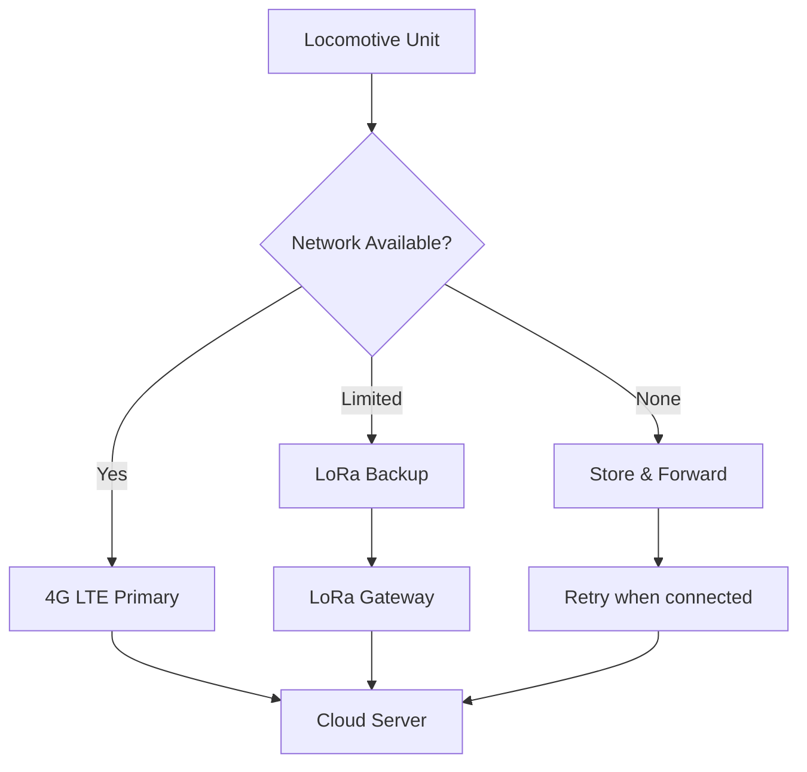
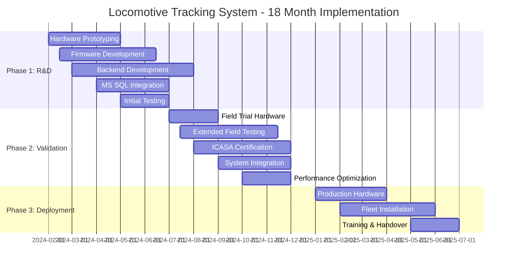

# South African Railway Locomotive GPS Tracking System
## Complete Project Implementation Guide

---

## Executive Summary

**Project Goal:** Develop a scalable GPS tracking system for locomotive fleet management across the South African rail network, providing real-time location data, route optimization, and comprehensive fleet visibility.

**Recommended Solution:** LILYGO T-SIM7600G-H with hybrid communication strategy (4G LTE primary, LoRa backup) and cloud-based data management.

**Total Investment:** R3,220 per unit hardware + R50/month operational costs

**Deployment Timeline:** 18 months for 100-unit rollout

---

## 1. Technical Requirements

### 1.1 Core Functionality
- **GPS Tracking:** Sub-5m accuracy with 1-minute update intervals
- **Data Transmission:** Real-time position reporting to central server
- **Coverage:** 99%+ across SA rail network including remote routes
- **Power:** Operate on 110V locomotive power with 48-hour battery backup
- **Environmental:** -20°C to +70°C, IP67 rated, vibration resistant
- **Scalability:** Support 100+ units with centralized management

### 1.2 Communication Requirements
- **Primary:** 4G LTE with 3G/2G fallback
- **Secondary:** 868MHz LoRa for dead zones and depot operations
- **Data Protocol:** MQTT over TLS for secure transmission
- **Bandwidth:** 50MB/month per unit typical usage

### 1.3 Regulatory Compliance
- **ICASA Type Approval:** Required for commercial deployment
- **Frequency Bands:** 
  - Cellular: Standard SA bands (900/1800/2100/2600 MHz)
  - LoRa: 868 MHz ISM band (25mW ERP, 1% duty cycle)
- **Safety:** Railway electrical safety standards

---

## 2. Hardware Configuration

### 2.1 Primary Configuration: T-SIM7600G-H Solution ✅ FINAL RECOMMENDATION

**Note:** While the T-A7670G R2 With GPS exists and was referenced in the original conversation, customer reports indicate GPS reliability issues. The T-SIM7600G-H remains the optimal choice.

| Component | Model | Unit Price (ZAR) | Quantity | Total | Purpose |
|-----------|--------|------------------|----------|--------|----------|
| **Main Board** | LILYGO T-SIM7600G-H | R1,500 | 1 | R1,500 | ESP32 + 4G LTE + GPS |
| **LoRa Module** | RFM95W 868MHz | R150 | 1 | R150 | Backup communication |
| **Antennas** | 4G/GPS Combo + LoRa | R250 | 1 | R250 | Signal reception |
| **Power Supply** | Mean Well IRM-20-5 | R250 | 1 | R250 | 110VAC to 5VDC |
| **Backup Power** | 18650 Battery x2 | R120 | 1 | R120 | 48-hour backup |
| **Storage** | 32GB MicroSD | R120 | 1 | R120 | Local data logging |
| **Enclosure** | IP67 Junction Box | R350 | 1 | R350 | Environmental protection |
| **Mounting** | DIN Rail + Brackets | R50 | 1 | R50 | Secure installation |
| **Protection** | Surge/EMI Protection | R200 | 1 | R200 | Electrical safety |
| **Cables/Misc** | Connectors, wiring | R150 | 1 | R150 | Assembly |
| **Optional Sensors** | Accelerometer, Temp | R80 | 1 | R80 | Enhanced monitoring |
| **TOTAL** | | | | **R3,220** | **Per unit cost** |

### 2.2 Why T-SIM7600G-H is Optimal

**Advantages over alternatives:**
- **vs T-SIM7000G:** Better coverage (4G/3G vs NB-IoT only), similar price with GPS included
- **vs T-SIM A7670E:** Has integrated GPS (saves R200), better network support (Cat-4 vs Cat-1)
- **vs Modular approach:** Lower total cost, proven reliability, faster deployment

**Network Support:**
- 4G LTE Cat-4: 150/50 Mbps on all SA networks
- 3G HSPA+: 42/11 Mbps fallback
- 2G GPRS: Universal coverage fallback
- Works with any SIM card (standard or IoT)

---

## 3. Network Strategy

### 3.1 Hybrid Communication Architecture



### 3.2 Coverage Strategy by Route

| Route Segment | Primary Network | Fallback | Coverage |
|---------------|----------------|----------|-----------|
| **Urban Areas** | 4G LTE (Vodacom/MTN) | 3G/2G | 99%+ |
| **Main Lines** | 4G LTE | 3G/2G | 95%+ |
| **Coal Routes** | 4G/3G | 2G + LoRa | 90%+ |
| **Iron Ore Line** | 3G/2G | LoRa gateways | 85%+ |
| **Rural Branches** | 2G | LoRa + Store-forward | 80%+ |
| **Depots/Yards** | WiFi/4G | LoRa (free data) | 99%+ |

### 3.3 SIM Card Options

| Provider | Plan Type | Monthly Cost | Best For |
|----------|-----------|--------------|----------|
| **MTN IoT** | NB-IoT + 4G | R30 + R0.10/MB | Recommended |
| **Vodacom OneNet** | 4G IoT | R35 + R0.15/MB | Alternative |
| **Standard Prepaid** | Any network | R50-100 | Testing only |
| **Bulk Contract** | Negotiated | R25-40 | Production (100+ units) |

---

## 4. Software Architecture

### 4.1 Embedded Firmware (ESP32)

```cpp
// Core system architecture
class LocomotiveTracker {
private:
    GPS gps;
    CellularModem cellular;
    LoRaWAN lora;
    SDLogger storage;
    PowerManager power;
    
public:
    void setup() {
        initializeHardware();
        establishConnectivity();
        loadConfiguration();
        startTracking();
    }
    
    void loop() {
        Position pos = gps.getCurrentPosition();
        
        // Intelligent transmission hierarchy
        if (cellular.isConnected() && cellular.signalStrength() > threshold) {
            transmitViaCellular(pos);
        } else if (lora.isGatewayInRange()) {
            transmitViaLoRa(pos);
        } else {
            storage.logForLater(pos);
        }
        
        managePowerState();
        handleMaintenanceAlerts();
        
        deepSleep(getAdaptiveInterval());
    }
};
```

### 4.2 Key Features
- **Adaptive reporting:** 30s when moving, 10min when stationary
- **Intelligent connectivity:** Automatic network selection
- **Power optimization:** ESP32 deep sleep between reports
- **Data buffering:** Store up to 7 days of data locally
- **OTA updates:** Remote firmware management via cellular
- **Geofencing:** Alerts for route deviations
- **Diagnostics:** Remote health monitoring

### 4.3 Backend Software Requirements

**Core Infrastructure:**
```csharp
// Primary application stack
- .NET Core 8.0 Web API
- Entity Framework Core with spatial extensions
- MQTTnet library for MQTT broker functionality
- SignalR for real-time communications
- ASP.NET Core Identity for authentication
- Hangfire for background task processing
```

**Required Software Components:**

| Component | Technology | Purpose | Integration |
|-----------|------------|---------|-------------|
| **MQTT Broker** | MQTTnet (.NET) | Device message ingestion | Embedded in API |
| **Spatial Extensions** | MS SQL Server Spatial | Geographic data storage | Native SQL support |
| **Real-time Engine** | SignalR | Live dashboard updates | ASP.NET Core built-in |
| **Background Services** | Hangfire | Data processing, alerts | .NET hosted service |
| **API Gateway** | ASP.NET Core | RESTful services | Native framework |
| **Authentication** | Active Directory | User management | Existing infrastructure |
| **Reporting** | SQL Reporting Services | Fleet reports | Existing SSRS server |
| **Monitoring** | Application Insights | System health | Azure/On-premise |

**Database Schema Extensions:**
```sql
-- Additional tables needed in existing MS SQL Server
CREATE TABLE Locomotives (
    LocomotiveID INT PRIMARY KEY,
    SerialNumber NVARCHAR(50),
    DeviceIMEI NVARCHAR(20),
    IsActive BIT,
    LastSeen DATETIME2
);

CREATE TABLE LocationHistory (
    ID BIGINT IDENTITY PRIMARY KEY,
    LocomotiveID INT,
    Timestamp DATETIME2,
    Location GEOGRAPHY,
    Speed FLOAT,
    Heading FLOAT,
    Altitude FLOAT,
    HDOP FLOAT
);

CREATE TABLE DeviceAlerts (
    AlertID BIGINT IDENTITY PRIMARY KEY,
    LocomotiveID INT,
    AlertType NVARCHAR(50),
    Message NVARCHAR(500),
    Timestamp DATETIME2,
    IsResolved BIT
);
```

**Integration Points:**
- **Existing ERP:** REST API integration for locomotive master data
- **Maintenance System:** Alert forwarding for geofence violations
- **Reporting Services:** Scheduled reports using existing SSRS
- **Active Directory:** Single sign-on for dashboard access
- **Network Infrastructure:** Use existing VPN/firewall rules

---

## 5. Implementation Plan

### 5.1 Phase 1: Research & Development (Months 1-6)
- **Scope:** Hardware prototyping, software development, initial testing
- **Resources:** 2 developers, 1 systems analyst
- **Objectives:** 
  - Complete hardware prototype with 2-3 test units
  - Develop core firmware with GPS tracking and cellular communication
  - Create basic backend services and database schema
  - Establish MS SQL Server spatial data architecture
- **Budget:** R30,000 hardware + R180,000 development costs
- **Success Criteria:** Reliable GPS tracking, successful data transmission, basic dashboard functionality

### 5.2 Phase 2: Field Testing & Validation (Months 7-12)
- **Scope:** Extended field trials, system refinement, integration development
- **Resources:** 2 developers, 1 network engineer, 1 field technician
- **Objectives:** 
  - Deploy 10-15 units on selected routes for comprehensive testing
  - Integrate with existing MS SQL infrastructure
  - Develop full dashboard and reporting capabilities
  - Complete ICASA certification process
  - Refine power management and reliability
- **Budget:** R80,000 hardware + R200,000 development/testing costs
- **Success Criteria:** 99% uptime, complete route coverage validation, ICASA approval

### 5.3 Phase 3: Production Deployment (Months 13-18)
- **Scope:** Full fleet rollout and operational handover
- **Resources:** 1 developer (maintenance), 2 field technicians, 1 project manager
- **Objectives:** 
  - Manufacture and deploy 100+ production units
  - Complete integration with existing railway management systems
  - Staff training and knowledge transfer
  - Establish maintenance and support procedures
- **Budget:** R264,000 hardware + R100,000 deployment costs
- **Success Criteria:** Complete fleet visibility, operational acceptance, handover to maintenance team

### 5.4 Extended Timeline & Milestones



---

## 6. Financial Analysis

### 6.1 Capital Investment (100 Units)

| Category | Cost | Percentage |
|----------|------|------------|
| **Hardware** | R322,000 | 78% |
| **Development** | R50,000 | 12% |
| **Testing & Certification** | R25,000 | 6% |
| **Installation & Training** | R15,000 | 4% |
| **TOTAL CAPEX** | **R412,000** | **100%** |

### 6.2 Operational Costs (Monthly) - Updated for Extended Timeline

| Item | Per Unit | 100 Units | Annual |
|------|----------|-----------|---------|
| **Data Plans** | R35 | R3,500 | R42,000 |
| **Data Usage** | R15 | R1,500 | R18,000 |
| **TOTAL OPEX** | **R50** | **R5,000** | **R60,000** |

### 6.3 Updated Investment Summary (18-Month Timeline)

| Phase | Duration | Investment | Purpose |
|-------|----------|------------|---------|
| **Phase 1: R&D** | Months 1-6 | R210,000 | Development & prototyping |
| **Phase 2: Testing** | Months 7-12 | R280,000 | Field trials & certification |
| **Phase 3: Deployment** | Months 13-18 | R422,000 | Production rollout |
| **TOTAL PROJECT COST** | **18 months** | **R912,000** | **Complete implementation** |

**Annual Operating Cost (Year 2+):** R60,000

---

## 7. Risk Management

### 7.1 Technical Risks

| Risk | Probability | Impact | Mitigation |
|------|-------------|--------|------------|
| **Cellular coverage gaps** | Medium | High | LoRa backup + store-and-forward |
| **Hardware failures** | Low | Medium | Industrial components + remote diagnostics |
| **Power outages** | Medium | Medium | 48-hour battery backup |
| **Software bugs** | Medium | Low | OTA updates + extensive testing |

### 7.2 Business Risks

| Risk | Probability | Impact | Mitigation |
|------|-------------|--------|------------|
| **Regulatory changes** | Low | High | ICASA pre-approval + industry monitoring |
| **Network operator changes** | Medium | Medium | Multi-carrier SIM support |
| **Technology obsolescence** | Low | Medium | Modular design + upgrade path |
| **Cost overruns** | Medium | Medium | Fixed-price contracts + contingency budget |

### 7.3 Security Measures

- **Device Authentication:** Unique certificates per device
- **Data Encryption:** TLS 1.3 with rotating keys
- **Network Security:** VPN tunnels, firewall rules
- **Physical Security:** Tamper-evident enclosures
- **Access Control:** Role-based dashboard permissions

---

## 8. Supplier Information (South Africa)

### 8.1 Hardware Suppliers

| Component | Supplier | Location | Lead Time |
|-----------|----------|----------|-----------|
| **LILYGO Boards** | Communica, MicroRobotics | Cape Town, Centurion | 2-3 weeks |
| **Antennas** | Poynting Antennas | Stellenbosch | 1 week |
| **Enclosures** | Pratley, Hellermann Tyton | Johannesburg | 1-2 weeks |
| **Power Supplies** | RS Components, Element14 | National | 3-5 days |
| **Electronics** | Communica, MicroRobotics | National | 1 week |

### 8.2 Service Providers

| Service | Provider | Coverage | Notes |
|---------|----------|----------|-------|
| **IoT Connectivity** | MTN Business IoT | National | Preferred for NB-IoT |
| **Backup Connectivity** | Vodacom OneNet | National | Secondary option |
| **Cloud Hosting** | AWS Cape Town | Regional | Low latency |
| **ICASA Certification** | SABS Test Lab | Pretoria | 4-6 weeks |

---

## 9. Next Steps

### 9.1 Immediate Actions (Weeks 1-4)
1. **Order pilot hardware:** 5x T-SIM7600G-H development kits
2. **Setup development environment:** ESP32 toolchain, Visual Studio with .NET Core
3. **Register MTN IoT SIM:** Business account with test SIM allocation  
4. **Infrastructure preparation:** MS SQL Server spatial extensions setup

### 9.2 Development Phase (Months 1-6)
1. **Hardware prototyping:** GPS tracking, cellular connectivity, power optimization
2. **Backend development:** .NET Core API, MQTT broker, database integration
3. **Dashboard creation:** ASP.NET Core with mapping functionality
4. **Integration planning:** Connect with existing MS SQL infrastructure

### 9.3 Field Testing Phase (Months 7-12)
1. **Extended field trials:** 10-15 units on operational routes
2. **ICASA certification:** Submit for type approval and compliance testing
3. **System integration:** Full backend integration with existing systems
4. **Performance validation:** Coverage testing and reliability assessment

### 9.4 Production Deployment (Months 13-18)
1. **Hardware procurement:** Bulk order 100+ production units
2. **Installation planning:** Site surveys and installation scheduling
3. **Staff training:** Technical and operational training programs
4. **Go-live preparation:** Final testing and operational handover

---

## 10. Technical Specifications Summary

### 10.1 Device Specifications
- **Processor:** ESP32-WROVER (240MHz dual-core, 8MB PSRAM)
- **Cellular:** SIM7600G (4G LTE Cat-4, 3G, 2G fallback)
- **GPS:** Integrated GNSS (GPS, GLONASS, BeiDou)
- **LoRa:** RFM95W (868MHz, 25mW output)
- **Storage:** 32GB MicroSD + 8MB PSRAM
- **Power:** 5V/2A input, 18650 backup (6800mAh)
- **Operating Range:** -20°C to +70°C
- **Dimensions:** 150×100×70mm (including enclosure)

### 10.2 Performance Specifications
- **GPS Accuracy:** <2.5m CEP (50% confidence)
- **Update Rate:** 1Hz GPS, configurable reporting
- **Battery Life:** 48 hours continuous operation
- **Data Usage:** ~50MB/month typical
- **Network Latency:** <500ms (4G), <2s (3G), <5s (2G)
- **Reliability:** 99.9% uptime target

---

## Conclusion

The corrected recommendation of **LILYGO T-SIM7600G-H** provides the optimal balance of functionality, reliability, and cost for South African railway operations. The hybrid communication strategy ensures comprehensive coverage while maintaining reasonable operational costs.

**Key Success Factors:**
- Proven hardware platform with integrated GPS
- Universal network compatibility across all SA carriers
- Robust backup communication via LoRa
- Scalable cloud infrastructure
- Comprehensive risk mitigation

**Investment Summary:**
- **Initial:** R412,000 for 100-unit deployment
- **Operational:** R60,000/year ongoing costs

This solution provides a foundation for modern fleet management, enabling data-driven decisions, operational optimization, and enhanced safety across the South African rail network.
