# South African Railway Locomotive GPS Tracking System

A comprehensive GPS tracking system for locomotive fleet management across the South African rail network, providing real-time location data, route optimization, and comprehensive fleet visibility.

## Project Overview

This project offers **five distinct implementation variants** to suit different operational requirements, budget constraints, and coverage needs for railway locomotive tracking in South Africa.

### 🚂 **Variant 1: [Cellular-Only](docs/cellular_only_option.md)**
*Simple, proven, real-time tracking*
- **Hardware Cost:** R2,870/unit
- **Monthly Cost:** R50/unit  
- **Timeline:** 15 months
- **Coverage:** 99%+ real-time
- **Best for:** Immediate deployment, real-time operations, proven reliability

### 📡 **Variant 2: [LoRa-Only](docs/lora_only_option.md)**  
*Cost-optimized store-and-forward*
- **Hardware Cost:** R1,550/unit
- **Monthly Cost:** R0 (zero operational costs)
- **Timeline:** 24 months  
- **Coverage:** 30-90% delayed data
- **Best for:** Budget-conscious deployments, comprehensive historical tracking

### 🌐 **Variant 3: [Cellular + LoRa Hybrid](docs/cellular_and_lora_option.md)**
*Maximum reliability and redundancy*
- **Hardware Cost:** R3,220/unit
- **Monthly Cost:** R50/unit
- **Timeline:** 18 months
- **Coverage:** 99%+ with backup redundancy
- **Best for:** Mission-critical operations, maximum uptime requirements

### 🛰️ **Variant 4: [Satellite-Only](docs/satellite_only_option.md)**
*Global coverage for remote operations*
- **Hardware Cost:** R4,790-R18,950/unit
- **Monthly Cost:** R75-R1,200/unit
- **Timeline:** 12 months
- **Coverage:** 100% global including remote areas
- **Best for:** Cross-border operations, extreme remote routes, disaster resilience

### 🔧 **Variant 5: [Modular System](docs/modular_system_option.md)** ⭐ RECOMMENDED
*Ultimate flexibility with hot-swappable modules*
- **Hardware Cost:** R2,100 base + R250-R4,850 per module
- **Monthly Cost:** R0-R175/unit (route dependent)
- **Timeline:** 12 months
- **Coverage:** 100% configurable
- **Best for:** Mixed fleet operations, future-proofing, cost optimization

---

## Quick Comparison

| Aspect | Cellular | LoRa | Hybrid | Satellite | Modular |
|--------|----------|------|--------|-----------|---------|
| **Real-time Capability** | ✅ Excellent | ❌ Limited | ✅ Excellent | ⚠️ Variable | ✅ Configurable |
| **Coverage** | 99%+ | 30-90% | 99%+ | 100% Global | 100% Configurable |
| **Initial Cost (100 units)** | R637K | R551K | R1,013K | R679K | R542K |
| **5-Year Total Cost** | R937K | R551K | R1,343K | R1,179K | **R880K** |
| **Deployment Complexity** | Low | High | Medium | Low | Medium |
| **Infrastructure Required** | None | Gateways | Gateways | None | None |
| **Field Reconfigurable** | No | No | No | No | **Yes** |
| **Future-Proof** | Poor | Poor | Fair | Poor | **Excellent** |

---

## Why Choose the Modular System?

The **Modular System (Variant 5)** represents the optimal solution for most deployments:

### Key Advantages
- **🔄 Hot-swappable modules** - Change communication methods in <5 minutes
- **💰 Route-optimized costs** - Use free LoRa in depots, cellular on main lines, satellite only where needed
- **🚀 Future-proof** - Add new technologies (5G, Starlink, etc.) without replacing units
- **🛠️ Simplified maintenance** - Replace faulty modules, not entire units
- **📊 Single platform** - One system to train technicians on, regardless of configuration
- **🔀 Automatic failover** - Seamless switching between available networks

### Module Options
- **Cellular Module** (R850) - 4G/3G/2G connectivity for urban and main routes
- **LoRa Module** (R250) - Free communication in depot and gateway areas
- **Satellite Module** (R3,200-R4,850) - Global coverage for remote operations
- **Future Modules** - 5G, WiFi 6, Private LTE, Starlink (when available)

---

## Technical Foundation

### Core Hardware Platform
All variants are built on proven, industrial-grade hardware:
- **ESP32-based processing** for reliable embedded computing
- **Multi-GNSS GPS** (GPS, GLONASS, BeiDou, Galileo) for accuracy
- **Railway-grade enclosures** (IP67, vibration resistant, -20°C to +70°C)
- **Locomotive power integration** with 48-hour battery backup
- **Secure data logging** with local storage capabilities

### Modular System Architecture
```
┌─────────────────────────────────────────┐
│         MODULAR MOTHERBOARD             │
│  ┌────────┐  ┌────────┐  ┌──────────┐   │
│  │  GPS   │  │ ESP32  │  │ STORAGE  │   │
│  └────────┘  └────────┘  └──────────┘   │
│                                         │
│  MODULE SLOTS: [1] [2] [3] [4]          │
└─────────────────────────────────────────┘
           ↓        ↓        ↓
      [Cellular] [LoRa] [Satellite]
```

### Unified Software Architecture
- **Modular firmware** supporting all communication variants
- **Automatic network selection** based on availability and cost
- **Route-based profiles** for optimal module usage
- **.NET Core backend** with spatial database integration
- **Real-time dashboard** with mapping and fleet management
- **OTA updates** for remote maintenance

---

## Implementation Strategy

### Recommended Approach: Modular Deployment

#### Phase 1: Core Infrastructure (Months 1-4)
1. Develop modular motherboard and firmware
2. Create module interface specifications
3. Setup backend infrastructure
4. Order initial hardware batch

#### Phase 2: Pilot Program (Months 5-8)
1. Deploy 20 units with various configurations:
   - Urban routes: Cellular module only
   - Remote routes: Cellular + Satellite modules
   - Depot operations: LoRa module only
2. Validate automatic failover and hot-swapping
3. Optimize route-based profiles

#### Phase 3: Fleet Rollout (Months 9-12)
1. Manufacture 100 motherboards
2. Deploy modules based on route analysis:
   - 85x Cellular modules
   - 50x LoRa modules
   - 15x Satellite modules
3. Configure units per locomotive route assignment
4. Train maintenance staff on module swapping

---

## Financial Analysis

### Total Cost of Ownership (100 Units, 5 Years)

| Solution | Hardware | Development | Operations | **5-Year Total** | Rank |
|----------|----------|-------------|------------|------------------|------|
| **LoRa-Only** | R551K | R0K | R0K | **R551K** | 1st |
| **Modular System** | R542K | R215K | R340K | **R880K** | 2nd |
| **Cellular-Only** | R637K | R0K | R300K | **R937K** | 3rd |
| **Satellite-Only** | R479K | R200K | R500K | **R1,179K** | 4th |
| **Hybrid Fixed** | R1,013K | R0K | R330K | **R1,343K** | 5th |

### Why Modular Offers Best Value
Despite not being the cheapest, the modular system provides the best overall value through:
- **20-40% operational cost savings** through route optimization
- **50% lower maintenance costs** through module standardization
- **75% lower upgrade costs** when adding new technologies
- **90% reduction in downtime** through hot-swappable modules

---

## Route-Based Deployment Guide

### Configuration by Route Type

| Route Type | Recommended Config | Modules | Monthly Cost |
|------------|-------------------|---------|--------------|
| **Urban/Suburban** | Cellular only | 1x Cell | R50 |
| **Main Freight Lines** | Cellular + LoRa backup | 1x Cell, 1x LoRa | R50 |
| **Coal Routes** | Cellular primary | 1x Cell | R50 |
| **Iron Ore Line** | Satellite + Cellular | 1x Sat, 1x Cell | R125 |
| **Cross-Border** | Satellite primary | 1x Sat | R75-500 |
| **Depot/Yard** | LoRa only | 1x LoRa | R0 |
| **High-Value Cargo** | Full stack | All modules | R175 |

---

## Getting Started

### Quick Start Guide

1. **Evaluate Requirements**
   - Analyze route types and coverage needs
   - Determine real-time vs. historical tracking requirements
   - Assess budget for initial and ongoing costs

2. **Choose Implementation Variant**
   - **Immediate need + simple:** Cellular-Only
   - **Lowest cost:** LoRa-Only
   - **Maximum reliability:** Hybrid
   - **Remote operations:** Satellite-Only
   - **Best overall:** Modular System ⭐

3. **Development Setup**
```bash
# Clone repository
git clone https://github.com/yourusername/locomotive-tracker.git
cd locomotive-tracker

# Setup development environment
pip install platformio
pio init

# Build firmware for chosen variant
cd firmware/modular_system/  # or cellular_only, lora_only, etc.
pio run

# Setup backend
cd backend/api/
dotnet restore
dotnet build
```

4. **Hardware Prototyping**
   - Order development boards for chosen variant
   - For modular system: Start with motherboard + 1 module type
   - Setup test environment with GPS simulator
   - Validate communication and failover

---

## Project Structure

```
locomotive-tracker/
├── docs/                              # Comprehensive documentation
│   ├── cellular_only_option.md       # Variant 1 specifications
│   ├── lora_only_option.md           # Variant 2 specifications
│   ├── cellular_and_lora_option.md   # Variant 3 specifications
│   ├── satellite_only_option.md      # Variant 4 specifications
│   ├── modular_system_option.md      # Variant 5 specifications ⭐
│   └── implementation_comparison.md   # Detailed 5-variant analysis
├── firmware/                          # Embedded software
│   ├── common/                        # Shared libraries
│   ├── cellular_only/                 # Variant 1 firmware
│   ├── lora_only/                     # Variant 2 firmware
│   ├── hybrid/                        # Variant 3 firmware
│   ├── satellite_only/                # Variant 4 firmware
│   ├── modular_system/                # Variant 5 firmware ⭐
│   │   ├── motherboard/               # Base system firmware
│   │   ├── modules/                   # Module drivers
│   │   └── profiles/                  # Route configurations
│   └── gateway/                       # LoRa gateway firmware
├── hardware/                          # Hardware designs
│   ├── cellular_only/                 # Variant 1 PCB designs
│   ├── lora_only/                     # Variant 2 PCB designs
│   ├── hybrid/                        # Variant 3 PCB designs
│   ├── satellite_only/                # Variant 4 PCB designs
│   ├── modular_system/                # Variant 5 designs ⭐
│   │   ├── motherboard/               # Base board design
│   │   ├── module_cellular/           # Cellular module PCB
│   │   ├── module_lora/               # LoRa module PCB
│   │   └── module_satellite/          # Satellite module PCB
│   └── common/                        # Shared components
├── backend/                           # Server applications
│   ├── api/                          # .NET Core Web API
│   ├── database/                     # SQL Server + Spatial
│   └── dashboard/                    # Web dashboard
├── tools/                            # Development utilities
│   ├── simulator/                    # GPS/Network simulator
│   ├── analyzer/                     # Coverage analysis
│   └── configurator/                 # Module config tool
└── .archive/                         # Legacy files and documentation
    ├── readme_original.md            # Original 3-variant README
    └── implementation_comparison_3variant.md  # Original comparison
```

---

## Compliance & Certification

### South African Requirements
- **ICASA certification** for all RF components
- **Railway Safety Regulator** compliance
- **POPI Act** data privacy compliance
- **SANS standards** for railway electronics

### Network Compatibility
- **Cellular:** MTN, Vodacom, Cell C, Telkom
- **LoRa:** 868MHz ISM band compliance
- **Satellite:** Swarm (pending SA approval), Iridium (approved)

---

## Support & Documentation

### Documentation
- 📋 **[Implementation Comparison](docs/implementation_comparison.md)** - Detailed 5-variant analysis
- 🚂 **[Cellular-Only Guide](docs/cellular_only_option.md)** - Variant 1 complete guide
- 📡 **[LoRa-Only Guide](docs/lora_only_option.md)** - Variant 2 complete guide  
- 🌐 **[Hybrid Guide](docs/cellular_and_lora_option.md)** - Variant 3 complete guide
- 🛰️ **[Satellite-Only Guide](docs/satellite_only_option.md)** - Variant 4 complete guide
- 🔧 **[Modular System Guide](docs/modular_system_option.md)** - Variant 5 complete guide ⭐

### Community & Support
- **GitHub Issues:** [Report bugs or request features](https://github.com/yourusername/locomotive-tracker/issues)
- **Discussions:** [Community forum](https://github.com/yourusername/locomotive-tracker/discussions)
- **Wiki:** [Extended documentation](https://github.com/yourusername/locomotive-tracker/wiki)

---

## Contributing

We welcome contributions in the following areas:
- **Hardware design** improvements and cost optimization
- **Firmware development** for new features and modules
- **Backend services** enhancements
- **New communication modules** (5G, Starlink, etc.)
- **Documentation** and guides
- **Testing** and validation

### Development Guidelines
1. Follow modular design principles
2. Maintain backward compatibility
3. Document all interfaces thoroughly
4. Test in railway environments
5. Ensure regulatory compliance

---

## License

This project is licensed under the MIT License - see the [LICENSE](LICENSE) file for details.

## Acknowledgments

- **South African Railway Industry** for operational requirements and field testing
- **Espressif Systems** for ESP32 platform
- **LILYGO** for development boards
- **Swarm Technologies** for satellite IoT innovation
- **LoRa Alliance** for protocol development
- **Community Contributors** for continuous improvements

---

## Quick Decision Guide

```mermaid
graph TD
    A[Start] --> B{Budget Critical?}
    B -->|Yes| C{Real-time Needed?}
    B -->|No| D{Remote Routes?}
    C -->|Yes| E[Cellular-Only]
    C -->|No| F[LoRa-Only]
    D -->|Yes| G{Multiple Routes?}
    D -->|No| H[Cellular-Only]
    G -->|Yes| I[Modular System ⭐]
    G -->|No| J[Satellite-Only]
```



---

*Developed for the South African railway industry with focus on practical, cost-effective, and reliable locomotive tracking solutions. The modular system represents the future of flexible, adaptive fleet management.*