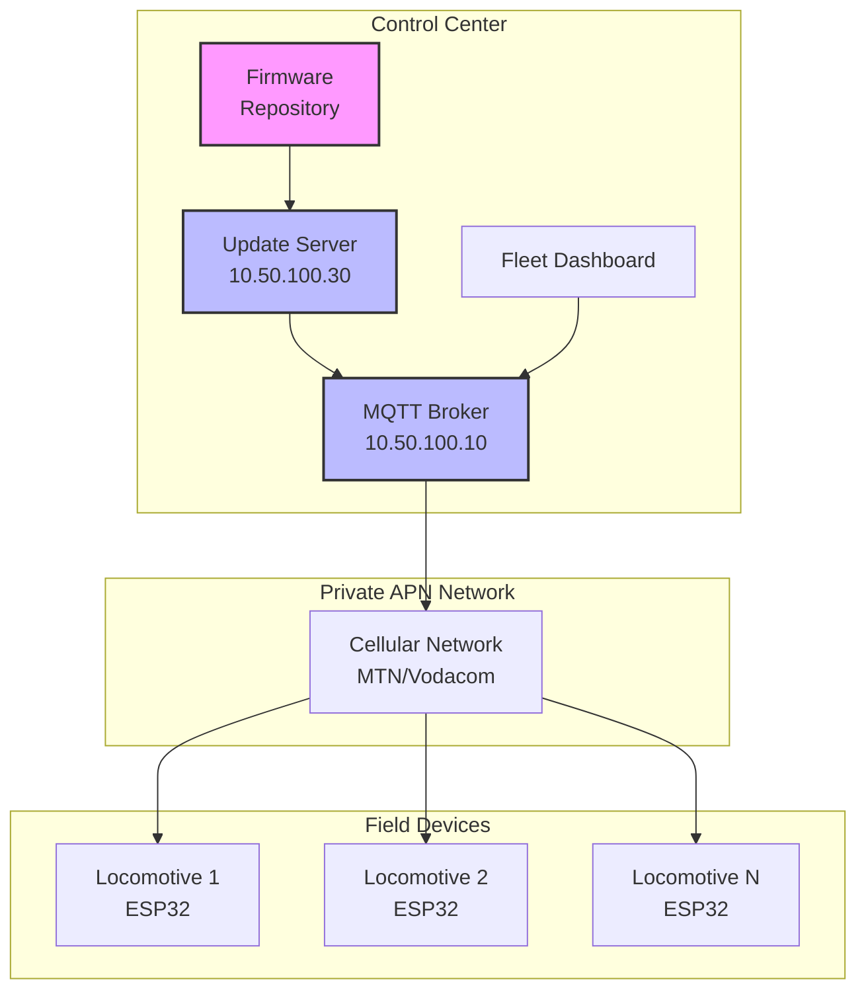
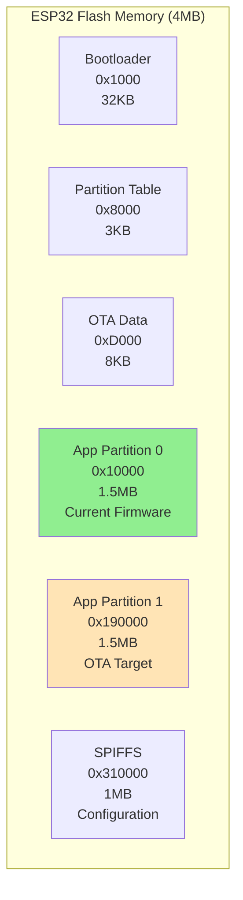
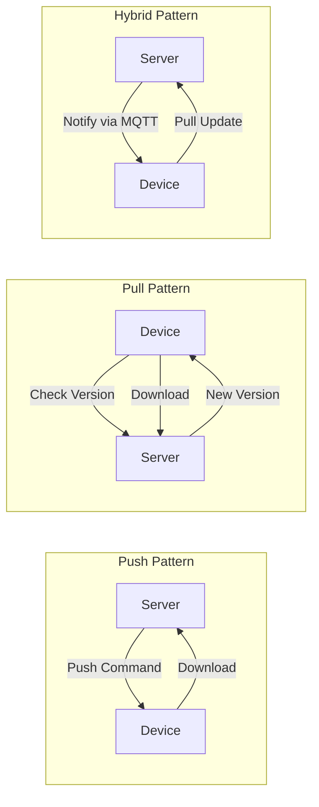
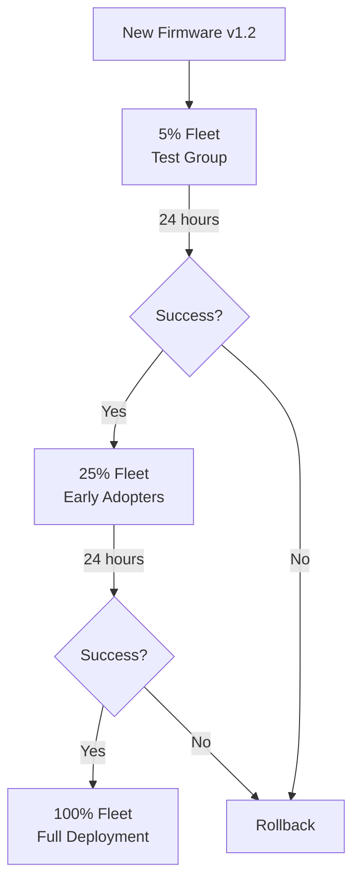
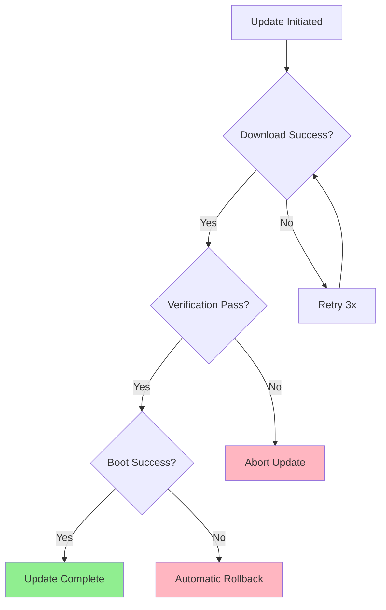

# Over-The-Air (OTA) Updates Implementation Guide
## ESP32 Railway Tracking System with Cellular Connectivity

---

## 1. Overview

### What is OTA?
Over-The-Air (OTA) updates enable remote firmware updates to ESP32 devices deployed in the field using their cellular connection. No physical access required - update your entire locomotive fleet from your office.

### Key Benefits
- **Zero downtime** - Updates happen in background
- **Fleet-wide deployment** - Update 100+ units remotely
- **Rollback capability** - Automatic recovery from failed updates
- **Version control** - Track firmware versions across fleet
- **Cost savings** - No technician site visits

---

## 2. Architecture

### 2.1 System Overview



### 2.2 ESP32 Memory Layout



**How it works:**
1. Current firmware runs from **Partition 0** (green)
2. New firmware downloads to **Partition 1** (orange)
3. After verification, ESP32 boots from new partition
4. If boot fails, automatically rollback to previous

---

## 3. Implementation Steps

### 3.1 PlatformIO Configuration

```ini
; platformio.ini
[env:t-sim7600g-h]
platform = espressif32
board = esp32dev
framework = arduino
monitor_speed = 115200

; Partition scheme for OTA
board_build.partitions = partitions_two_ota.csv

; Libraries
lib_deps = 
    TinyGSM@0.11.7
    ArduinoJson@6.21.3
    PubSubClient@2.8
    ESP32httpUpdate@2.1.145

; OTA Upload settings
upload_protocol = espota
upload_port = 10.50.100.30
upload_flags = 
    --port=3232
    --auth=your_ota_password
```

### 3.2 Partition Table

```csv
# partitions_two_ota.csv
# Name,   Type, SubType,  Offset,   Size,    Flags
nvs,      data, nvs,      0x9000,   0x5000,
otadata,  data, ota,      0xe000,   0x2000,
app0,     app,  ota_0,    0x10000,  0x180000,
app1,     app,  ota_1,    0x190000, 0x180000,
spiffs,   data, spiffs,   0x310000, 0x100000,
```

---

## 4. Core Implementation

### 4.1 Basic OTA Handler

```cpp
#include <HTTPUpdate.h>
#include <TinyGsmClient.h>

// Modem configuration
#define MODEM_TX 27
#define MODEM_RX 26
HardwareSerial SerialAT(1);
TinyGsm modem(SerialAT);
TinyGsmClient client(modem);

class OTAManager {
private:
    const char* firmware_url = "http://10.50.100.30/firmware/";
    const char* current_version = "1.0.0";
    
public:
    void begin() {
        // Initialize modem
        SerialAT.begin(115200, SERIAL_8N1, MODEM_RX, MODEM_TX);
        modem.restart();
        
        // Connect to private APN
        modem.gprsConnect("transnet.m2m", "railway", "password");
    }
    
    bool checkForUpdate() {
        HTTPClient http;
        http.begin(client, String(firmware_url) + "version.txt");
        
        int httpCode = http.GET();
        if (httpCode == 200) {
            String newVersion = http.getString();
            if (newVersion > current_version) {
                Serial.println("New version available: " + newVersion);
                return true;
            }
        }
        return false;
    }
    
    void performUpdate() {
        String url = String(firmware_url) + "firmware.bin";
        
        Serial.println("Starting OTA update...");
        httpUpdate.setLedPin(LED_BUILTIN, LOW);
        
        t_httpUpdate_return ret = httpUpdate.update(client, url);
        
        switch(ret) {
            case HTTP_UPDATE_FAILED:
                Serial.printf("Update failed: %s\n", 
                    httpUpdate.getLastErrorString().c_str());
                break;
                
            case HTTP_UPDATE_NO_UPDATES:
                Serial.println("No updates available");
                break;
                
            case HTTP_UPDATE_OK:
                Serial.println("Update successful!");
                ESP.restart();
                break;
        }
    }
};
```

### 4.2 Advanced Fleet Management

```cpp
class FleetOTAManager : public OTAManager {
private:
    PubSubClient mqtt;
    String device_id;
    bool update_pending = false;
    
public:
    void begin() {
        OTAManager::begin();
        
        // Setup MQTT for fleet commands
        mqtt.setServer("10.50.100.10", 1883);
        mqtt.setCallback([this](char* topic, byte* payload, unsigned int length) {
            this->handleMqttMessage(topic, payload, length);
        });
        
        // Subscribe to fleet update topics
        mqtt.subscribe("fleet/all/update");
        mqtt.subscribe(("fleet/" + device_id + "/update").c_str());
        mqtt.subscribe("fleet/group1/update");  // Assign groups
    }
    
    void handleMqttMessage(char* topic, byte* payload, unsigned int length) {
        StaticJsonDocument<256> doc;
        deserializeJson(doc, payload, length);
        
        if (strstr(topic, "update")) {
            // Parse update command
            const char* version = doc["version"];
            const char* url = doc["url"];
            int delay_seconds = doc["delay"] | 0;
            
            // Schedule update
            scheduleUpdate(url, delay_seconds);
        }
    }
    
    void scheduleUpdate(const char* url, int delay_seconds) {
        // Add random jitter to prevent thundering herd
        int jitter = random(0, 60);
        delay((delay_seconds + jitter) * 1000);
        
        // Perform update
        performUpdateFromUrl(url);
    }
    
    void reportStatus() {
        StaticJsonDocument<256> status;
        status["device_id"] = device_id;
        status["version"] = current_version;
        status["partition"] = esp_ota_get_boot_partition()->label;
        status["free_heap"] = ESP.getFreeHeap();
        status["uptime"] = millis();
        
        String output;
        serializeJson(status, output);
        mqtt.publish("fleet/status", output.c_str());
    }
};
```

---

## 5. Update Strategies

### 5.1 Update Patterns



### 5.2 Fleet Deployment Strategies

#### Strategy 1: Canary Deployment


#### Strategy 2: Geographic Rollout
```cpp
void deployByRegion(String region) {
    if (region == "gauteng") {
        mqtt.publish("fleet/gauteng/update", update_payload);
    } else if (region == "western_cape") {
        mqtt.publish("fleet/western_cape/update", update_payload);
    }
    // Monitor each region before proceeding
}
```

#### Strategy 3: Time-Based Staging
```cpp
void staggeredUpdate() {
    for (int group = 0; group < 10; group++) {
        String topic = "fleet/group" + String(group) + "/update";
        mqtt.publish(topic.c_str(), update_payload);
        
        delay(300000); // 5 minutes between groups
        
        // Check success rate
        if (getGroupSuccessRate(group) < 0.95) {
            Serial.println("Halting rollout - low success rate");
            break;
        }
    }
}
```

---

## 6. Security Implementation

### 6.1 Secure OTA Framework

```cpp
class SecureOTA {
private:
    // Certificate for HTTPS
    const char* root_ca = R"(
-----BEGIN CERTIFICATE-----
[Your Private CA Certificate]
-----END CERTIFICATE-----
)";
    
public:
    bool verifyFirmware(uint8_t* firmware, size_t size) {
        // 1. Check firmware signature
        if (!verifySignature(firmware, size)) {
            return false;
        }
        
        // 2. Verify version is newer
        if (!isNewerVersion(firmware)) {
            return false;
        }
        
        // 3. Check device compatibility
        if (!isCompatible(firmware)) {
            return false;
        }
        
        return true;
    }
    
    void performSecureUpdate() {
        // Use HTTPS with certificate validation
        WiFiClientSecure secureClient;
        secureClient.setCACert(root_ca);
        
        // Add authentication header
        httpUpdate.setAuthorization("Bearer YOUR_SECRET_TOKEN");
        
        // Verify MD5 hash
        httpUpdate.setMD5("expected-md5-hash");
        
        // Perform update
        t_httpUpdate_return ret = httpUpdate.update(
            secureClient, 
            "https://10.50.100.30/firmware/signed.bin"
        );
    }
};
```

### 6.2 Rollback Protection

```cpp
void validateAndCommitUpdate() {
    // After OTA and reboot
    if (performSelfTest()) {
        // Mark new firmware as valid
        esp_ota_mark_app_valid_cancel_rollback();
        Serial.println("Update validated and committed");
    } else {
        // Rollback to previous version
        esp_ota_mark_app_invalid_rollback_and_reboot();
    }
}

bool performSelfTest() {
    // Test critical functions
    bool gps_ok = testGPS();
    bool cellular_ok = testCellular();
    bool mqtt_ok = testMQTT();
    
    return gps_ok && cellular_ok && mqtt_ok;
}
```

---

## 7. Server-Side Implementation

### 7.1 Update Server (Node.js)

```javascript
// update-server.js
const express = require('express');
const fs = require('fs');
const crypto = require('crypto');

const app = express();

// Firmware repository
const FIRMWARE_DIR = '/var/firmware/';

// Version management
app.get('/firmware/version.txt', (req, res) => {
    const latest = getLatestVersion();
    res.send(latest);
});

// Firmware download with authentication
app.get('/firmware/:version/firmware.bin', 
    authenticateDevice,
    (req, res) => {
        const version = req.params.version;
        const deviceId = req.headers['x-device-id'];
        
        // Log download attempt
        logUpdate(deviceId, version);
        
        // Send firmware with metadata
        const firmware = fs.readFileSync(
            `${FIRMWARE_DIR}/${version}/firmware.bin`
        );
        
        res.set({
            'Content-Type': 'application/octet-stream',
            'Content-Length': firmware.length,
            'X-MD5': calculateMD5(firmware),
            'X-Version': version
        });
        
        res.send(firmware);
    }
);

// Fleet management API
app.post('/api/fleet/update', (req, res) => {
    const { target, version, strategy } = req.body;
    
    if (strategy === 'canary') {
        deployCanary(target, version);
    } else if (strategy === 'staged') {
        deployStaged(target, version);
    } else {
        deployImmediate(target, version);
    }
    
    res.json({ status: 'update initiated' });
});
```

### 7.2 Fleet Dashboard

```python
# dashboard.py - Fleet OTA Management
import paho.mqtt.client as mqtt
import json
from datetime import datetime

class FleetManager:
    def __init__(self):
        self.devices = {}
        self.mqtt_client = mqtt.Client()
        self.mqtt_client.on_message = self.on_status_update
        
    def trigger_update(self, target='all', version='1.2.0'):
        """Trigger OTA update for target devices"""
        payload = {
            'version': version,
            'url': f'http://10.50.100.30/firmware/{version}/firmware.bin',
            'timestamp': datetime.utcnow().isoformat()
        }
        
        if target == 'all':
            # Staged deployment to prevent network overload
            for group in range(5):
                self.mqtt_client.publish(
                    f'fleet/group{group}/update',
                    json.dumps(payload)
                )
                time.sleep(300)  # 5 minutes between groups
        else:
            # Single device update
            self.mqtt_client.publish(
                f'fleet/{target}/update',
                json.dumps(payload)
            )
    
    def get_fleet_status(self):
        """Get current firmware versions across fleet"""
        return {
            'total_devices': len(self.devices),
            'versions': self.count_versions(),
            'update_progress': self.get_update_progress()
        }
```

---

## 8. Testing & Validation

### 8.1 Pre-Deployment Testing

```cpp
// test_ota.cpp
void testOTAProcess() {
    Serial.println("=== OTA Test Suite ===");
    
    // Test 1: Network connectivity
    assert(modem.isGprsConnected());
    Serial.println("✓ Cellular connected");
    
    // Test 2: Server reachability
    HTTPClient http;
    http.begin(client, "http://10.50.100.30/health");
    assert(http.GET() == 200);
    Serial.println("✓ Update server reachable");
    
    // Test 3: Partition validation
    const esp_partition_t* running = esp_ota_get_running_partition();
    const esp_partition_t* update = esp_ota_get_next_update_partition(NULL);
    assert(running != update);
    Serial.println("✓ OTA partitions configured");
    
    // Test 4: Rollback mechanism
    esp_ota_img_states_t state;
    esp_ota_get_state_partition(running, &state);
    assert(state == ESP_OTA_IMG_VALID);
    Serial.println("✓ Rollback mechanism ready");
    
    Serial.println("=== All tests passed ===");
}
```

### 8.2 Update Success Metrics



---

## 9. Troubleshooting

### 9.1 Common Issues & Solutions

| Issue | Cause | Solution |
|-------|-------|----------|
| **Update fails immediately** | Network not connected | Verify cellular connection before OTA |
| **Download timeout** | Poor signal | Implement retry with exponential backoff |
| **Verification fails** | Corrupted download | Add CRC32 validation |
| **Boot loop after update** | Bad firmware | Automatic rollback after 3 failed boots |
| **Partial fleet update** | Network congestion | Reduce group size, increase delays |

### 9.2 Debug Implementation

```cpp
// Enable detailed OTA debugging
void enableOTADebug() {
    httpUpdate.onStart([]() {
        Serial.println("OTA: Start");
    });
    
    httpUpdate.onEnd([]() {
        Serial.println("OTA: End");
    });
    
    httpUpdate.onProgress([](int cur, int total) {
        Serial.printf("OTA: %d/%d bytes (%.1f%%)\n", 
            cur, total, (cur * 100.0) / total);
    });
    
    httpUpdate.onError([](int err) {
        Serial.printf("OTA: Error[%d]: %s\n", 
            err, httpUpdate.getLastErrorString().c_str());
    });
}
```

---

## 10. Best Practices

### 10.1 Do's ✅

- **Always test updates** on subset before fleet-wide deployment
- **Implement version checking** to prevent downgrades
- **Use staged rollouts** to prevent network overload
- **Monitor success rates** and halt on failures
- **Keep backup firmware** on server for emergency rollback
- **Log all update attempts** for audit trail
- **Use secure HTTPS** with certificate validation
- **Implement watchdog timer** for automatic recovery

### 10.2 Don'ts ❌

- **Don't update all devices simultaneously** - causes network congestion
- **Don't skip verification** - always validate firmware integrity
- **Don't ignore battery level** - check power before updating
- **Don't update while moving** - wait for stationary periods
- **Don't use public servers** - keep firmware on private network
- **Don't hardcode URLs** - use configuration files

---

## 11. Production Checklist

### Pre-Deployment
- [ ] Partition table configured for OTA
- [ ] Cellular connection tested with private APN
- [ ] Update server accessible from devices
- [ ] Firmware signing implemented
- [ ] Rollback mechanism tested
- [ ] Version management system in place

### Deployment
- [ ] Canary group identified (5% of fleet)
- [ ] Monitoring dashboard operational
- [ ] Rollback procedure documented
- [ ] Network capacity verified
- [ ] Update scheduled for low-traffic period

### Post-Deployment
- [ ] Success rate > 95%
- [ ] No unexpected rollbacks
- [ ] All devices reporting new version
- [ ] Performance metrics normal
- [ ] Logs archived for audit

---

## 12. Example: Complete Implementation

```cpp
// main.cpp - Production OTA Implementation
#include <Arduino.h>
#include <HTTPUpdate.h>
#include <TinyGsmClient.h>
#include <PubSubClient.h>
#include <ArduinoJson.h>

// Configuration
#define FIRMWARE_VERSION "1.0.0"
#define DEVICE_ID "LOCO-001"
#define UPDATE_CHECK_INTERVAL 3600000  // 1 hour

// Modem configuration
TinyGsm modem(SerialAT);
TinyGsmClient gsm_client(modem);
PubSubClient mqtt(gsm_client);

// OTA Manager
class RailwayOTA {
private:
    unsigned long last_check = 0;
    bool update_available = false;
    String update_url;
    
public:
    void begin() {
        Serial.println("Railway OTA Manager v" FIRMWARE_VERSION);
        
        // Connect to private APN
        connectCellular();
        
        // Setup MQTT
        mqtt.setServer("10.50.100.10", 1883);
        mqtt.setCallback([this](char* topic, byte* payload, unsigned int length) {
            this->handleMqttOTA(topic, payload, length);
        });
        
        // Subscribe to OTA topics
        mqtt.subscribe("fleet/all/update");
        mqtt.subscribe("fleet/" DEVICE_ID "/update");
        
        // Report current version
        reportStatus();
    }
    
    void loop() {
        // Check for updates periodically
        if (millis() - last_check > UPDATE_CHECK_INTERVAL) {
            checkForUpdates();
            last_check = millis();
        }
        
        // Process pending update
        if (update_available && isGoodTimeForUpdate()) {
            performUpdate();
        }
        
        mqtt.loop();
    }
    
private:
    void connectCellular() {
        Serial.println("Connecting to private APN...");
        modem.gprsConnect("transnet.m2m", "railway", "password");
        
        while (!modem.isGprsConnected()) {
            delay(1000);
        }
        Serial.println("Connected!");
    }
    
    void checkForUpdates() {
        HTTPClient http;
        http.begin(gsm_client, "http://10.50.100.30/api/version");
        http.addHeader("X-Device-ID", DEVICE_ID);
        
        if (http.GET() == 200) {
            StaticJsonDocument<256> doc;
            deserializeJson(doc, http.getString());
            
            const char* latest = doc["version"];
            if (strcmp(latest, FIRMWARE_VERSION) > 0) {
                update_available = true;
                update_url = doc["url"].as<String>();
                Serial.println("Update available: " + String(latest));
            }
        }
    }
    
    bool isGoodTimeForUpdate() {
        // Check conditions
        bool stationary = true;  // Check GPS speed
        bool battery_ok = true;  // Check battery > 50%
        bool signal_ok = modem.getSignalQuality() > 10;
        
        return stationary && battery_ok && signal_ok;
    }
    
    void performUpdate() {
        Serial.println("Starting OTA update...");
        
        // Report update start
        mqtt.publish("fleet/status/" DEVICE_ID "/updating", "true");
        
        // Configure update
        httpUpdate.setLedPin(LED_BUILTIN, LOW);
        httpUpdate.onProgress([](int cur, int total) {
            static int last_percent = 0;
            int percent = (cur * 100) / total;
            if (percent != last_percent && percent % 10 == 0) {
                Serial.printf("Update: %d%%\n", percent);
                last_percent = percent;
            }
        });
        
        // Perform update
        t_httpUpdate_return ret = httpUpdate.update(gsm_client, update_url);
        
        if (ret == HTTP_UPDATE_OK) {
            Serial.println("Update successful! Restarting...");
            ESP.restart();
        } else {
            Serial.printf("Update failed: %s\n", 
                httpUpdate.getLastErrorString().c_str());
            update_available = false;
        }
    }
    
    void reportStatus() {
        StaticJsonDocument<256> status;
        status["device_id"] = DEVICE_ID;
        status["version"] = FIRMWARE_VERSION;
        status["uptime"] = millis();
        status["free_heap"] = ESP.getFreeHeap();
        
        String json;
        serializeJson(status, json);
        mqtt.publish("fleet/status/" DEVICE_ID, json.c_str());
    }
    
    void handleMqttOTA(char* topic, byte* payload, unsigned int length) {
        // Parse OTA command
        StaticJsonDocument<256> doc;
        deserializeJson(doc, payload, length);
        
        if (doc.containsKey("url")) {
            update_url = doc["url"].as<String>();
            update_available = true;
            
            // Add random delay to prevent thundering herd
            int delay_ms = random(0, 60000);
            delay(delay_ms);
        }
    }
};

// Global instance
RailwayOTA ota;

void setup() {
    Serial.begin(115200);
    ota.begin();
}

void loop() {
    ota.loop();
}
```

---

## Conclusion

OTA updates over cellular for ESP32 are **production-ready and reliable**. The T-SIM7600G-H with private APN provides a secure, efficient method to update your entire locomotive fleet without physical access. With proper implementation of staging, verification, and rollback mechanisms, you can maintain fleet firmware with confidence.

**Key Takeaways:**
- ✅ ESP32 fully supports OTA over cellular
- ✅ Private APN ensures secure updates
- ✅ Staged rollouts prevent network overload
- ✅ Automatic rollback protects against bad firmware
- ✅ Fleet-wide updates are manageable with proper planning

The system is ready for production deployment in your railway tracking application.