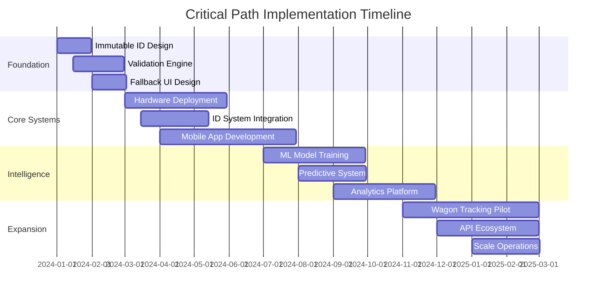

# Railway Locomotive Tracking System
## Solution Framework Assessment & Recommendations

**Document Version:** 1.0  
**Date:** December 2024  
**Status:** Framework Proposal  
**Classification:** Technical Assessment

---

## Table of Contents

1. [Executive Summary](#executive-summary)
2. [Problem Statement Analysis](#problem-statement-analysis)
3. [Current Solution Assessment](#current-solution-assessment)
4. [Critical Gaps & Improvements](#critical-gaps--improvements)
5. [Enhanced Solution Framework](#enhanced-solution-framework)
6. [Implementation Strategy](#implementation-strategy)
7. [Risk Analysis & Mitigation](#risk-analysis--mitigation)
8. [Success Metrics & KPIs](#success-metrics--kpis)
9. [Recommendations](#recommendations)

---

## Executive Summary

### Assessment Verdict
The proposed **Modular System with Cellular-Base (LILYGO T-A7670G R2 Q425)** with enhanced UI and train management integration is **fundamentally sound** for addressing Transnet's locomotive tracking and train identification challenges. However, several critical enhancements are required to ensure complete problem resolution.

### Key Findings
- ✅ **Correct Problem Focus**: Addresses both tracking (80%) and identification (20%) challenges
- ✅ **Technical Architecture**: Modular design with appropriate technology choices
- ⚠️ **Implementation Gaps**: Missing redundancy, validation, and fallback mechanisms
- 🚨 **Critical Risk**: Train number management still vulnerable to human error

### Primary Recommendations
1. Implement **immutable train identification system**
2. Add **multi-point verification** for redundancy
3. Deploy **intelligent data validation engine**
4. Create **comprehensive fallback mechanisms**
5. Integrate **predictive assignment capabilities**

---

## Problem Statement Analysis

### Core Challenges Identified

#### 1. Train Number Chaos
- **Root Cause**: Manual train number entry by TCOs
- **Impact**: Cascading errors across ITP, TMS, and VDU systems
- **Current State**: No single source of truth for train identity

#### 2. Vehicle List Integrity
- **Root Cause**: On-the-fly substitutions without system updates
- **Impact**: CAS and VIS systems cannot accurately identify vehicles
- **Current State**: Time delays between physical changes and system updates

#### 3. System Integration Breakdown
- **Root Cause**: Multiple disconnected systems with different data models
- **Impact**: Unable to correlate train numbers with vehicle lists
- **Current State**: Manual processes attempting to bridge system gaps

### Problem Prioritization Matrix

| Problem | Severity | Frequency | Business Impact | Priority |
|---------|----------|-----------|-----------------|----------|
| Train Number Management | Critical | Daily | Operations Paralysis | P0 |
| Vehicle List Accuracy | High | Daily | Safety & Compliance | P1 |
| System Integration | High | Continuous | Efficiency Loss | P1 |
| Real-time Tracking | Medium | Continuous | Asset Utilization | P2 |

---

## Current Solution Assessment

### Strengths

#### Architectural Design
- **Modular Approach**: Allows route-specific optimization
- **Cellular-First Strategy**: Immediate deployment capability
- **Hardware Selection**: ESP32 platform balances cost, power, and capability
- **Enhanced UI**: Enables critical human validation

#### Implementation Strategy
- **Phased Rollout**: Risk mitigation through staged deployment
- **OTA Capability**: Fleet-wide management without physical access
- **Integration Focus**: Direct connectivity with existing systems

#### Technical Specifications
- **Power Management**: 48-hour battery backup achievable
- **Communication Flexibility**: Multiple fallback options
- **Environmental Hardening**: Railway-grade specifications

### Weaknesses

#### Systematic Issues
1. **No Immutable Identification**: Still relies on changeable train numbers
2. **Single Point of Failure**: No redundant identification methods
3. **Limited Validation**: Insufficient cross-system data verification
4. **No Predictive Capability**: Reactive rather than proactive system

#### Implementation Gaps
1. **UI Failure Recovery**: No fallback if display/buttons fail
2. **Wagon Tracking**: Limited to locomotives only
3. **Offline Capability**: Incomplete store-and-forward implementation
4. **Security**: Basic authentication without role-based access

---

## Critical Gaps & Improvements

### Gap 1: Train Number Management Architecture

#### Current State
```
TCO Manual Entry → VDU System → Train Number Assignment
                        ↓
                  [High Error Rate]
```

#### Proposed Enhancement
```
System Generated ID → Immutable Train Registry → All Systems
         ↓                      ↓                     ↓
   [Unique Forever]    [Single Source Truth]    [Consistency]
```

#### Implementation Details
```yaml
Immutable Train ID System:
  Format: "YYYY-MM-DD-DEPOT-XXXXX"
  Components:
    - Date: Formation date
    - Depot: Origin location code
    - Serial: Daily sequential number
  Features:
    - Never reused or changed
    - Mapped to changing ITP numbers
    - Primary key across all systems
    - QR code generation for visual verification
```

### Gap 2: Redundant Identification Strategy

#### Current State
- Single GPS device per locomotive
- No backup identification method
- Failure means complete loss of tracking

#### Proposed Enhancement
```yaml
Multi-Layer Identification:
  Primary:
    - GPS tracking device with enhanced UI
  Secondary:
    - Passive RFID tags on locomotive
    - Read by existing VIS infrastructure
  Tertiary:
    - QR codes for manual verification
    - Bluetooth beacons for proximity detection
  Validation:
    - Cross-reference all identification methods
    - Alert on mismatches
    - Confidence scoring for position data
```

### Gap 3: Data Validation Engine

#### Current State
- No intelligent validation between systems
- Manual reconciliation of conflicts
- Delayed error detection

#### Proposed Enhancement
```python
class DataValidationEngine:
    def __init__(self):
        self.validators = [
            GeospatialValidator(),      # Impossible movements
            TemporalValidator(),         # Time consistency
            CompositionValidator(),      # Vehicle list integrity
            RouteValidator(),           # Path validation
            CrossSystemValidator()      # ITP/TMS/VDU consistency
        ]
    
    def validate_train_data(self, data):
        confidence_score = 100
        validation_results = []
        
        for validator in self.validators:
            result = validator.validate(data)
            confidence_score *= result.confidence
            validation_results.append(result)
        
        return {
            'valid': confidence_score > 0.75,
            'confidence': confidence_score,
            'issues': [r for r in validation_results if not r.passed],
            'recommendations': self.generate_recommendations(validation_results)
        }
```

### Gap 4: Fallback UI Mechanisms

#### Current State
- Complete dependency on physical display and buttons
- No alternative interaction methods
- Single point of failure for train assignments

#### Proposed Enhancement
```yaml
UI Fallback Hierarchy:
  Level 1 - Primary Interface:
    - 2.8" TFT display with buttons
    - Full functionality
  
  Level 2 - Degraded Visual:
    - LED status codes
    - Buzzer confirmation patterns
    - Basic operation without display
  
  Level 3 - Remote Interface:
    - Web UI via cellular hotspot
    - SMS command interface
    - Voice call IVR system
  
  Level 4 - Emergency Mode:
    - Automatic operation
    - Pre-configured behavior
    - Manual override at depot
```

---

## Enhanced Solution Framework

### System Architecture - Revised

```
┌────────────────────────────────────────────────────────────┐
│                   ENHANCED SOLUTION ARCHITECTURE           │
├────────────────────────────────────────────────────────────┤
│                                                            │
│  ┌──────────────────────────────────────────────────────┐  │
│  │            Immutable Train Registry                  │  │
│  │  - Unique IDs generated at formation                 │  │
│  │  - Never changed throughout lifecycle                │  │
│  │  - Mapped to all system identifiers                  │  │
│  └─────────────────┬────────────────────────────────────┘  │
│                    │                                       │
│  ┌─────────────────▼────────────────────────────────────┐  │
│  │         Data Validation & Intelligence Layer         │  │
│  │  - ML-based anomaly detection                        │  │
│  │  - Cross-system reconciliation                       │  │
│  │  - Predictive assignment engine                      │  │
│  │  - Confidence scoring system                         │  │
│  └─────────────────┬────────────────────────────────────┘  │
│                    │                                       │
│  ┌─────────────────▼────────────────────────────────────┐  │
│  │           Multi-Modal Tracking Layer                 │  │
│  │  ┌─────────┐ ┌─────────┐ ┌─────────┐ ┌─────────┐     │  │
│  │  │   GPS   │ │  RFID   │ │   BLE   │ │   QR    │     │  │
│  │  └─────────┘ └─────────┘ └─────────┘ └─────────┘     │  │
│  └─────────────────┬────────────────────────────────────┘  │
│                    │                                       │
│  ┌─────────────────▼────────────────────────────────────┐  │
│  │         Communication & Integration Layer            │  │
│  │  - Cellular (Primary)                                │  │
│  │  - LoRa (Depot optimization)                         │  │
│  │  - Satellite (Remote backup)                         │  │
│  │  - ITP/TMS/VDU integration                           │  │
│  └──────────────────────────────────────────────────────┘  │
│                                                            │
└────────────────────────────────────────────────────────────┘
```

### Technology Stack - Enhanced

#### Core Platform (Unchanged)
- **Hardware**: LILYGO T-A7670G R2 Q425
- **Processor**: ESP32 240MHz dual-core
- **Communication**: 4G/3G/2G cellular + optional modules
- **Power**: 110V railway + 48hr battery backup

#### New Components
```yaml
Additional Hardware:
  - RFID Tags: Passive UHF tags on each locomotive
  - BLE Beacons: For proximity detection (optional)
  - QR Codes: Weatherproof labels for manual verification

Software Enhancements:
  - Immutable ID Generator Service
  - Data Validation Engine
  - Predictive Assignment ML Model
  - Mobile Companion App
  - SMS Gateway Integration
  - Voice IVR System

Infrastructure:
  - Enhanced VIS Integration
  - ML Training Pipeline
  - Redundant MQTT Brokers
  - API Gateway with Circuit Breakers
```

---

## Implementation Strategy

### Revised Phased Approach

#### Phase 0: Foundation (Months 0-2)
```yaml
Objectives:
  - Design immutable ID system
  - Develop validation engine core
  - Create fallback UI prototypes
  - Establish test framework

Deliverables:
  - ID generation specification
  - Validation engine architecture
  - UI fallback design documents
  - Test automation framework

Budget: R150,000
Resources: 3 developers, 1 architect
```

#### Phase 1: Core Implementation (Months 3-8)
```yaml
Objectives:
  - Deploy tracking devices with enhanced validation
  - Implement immutable ID system
  - Integrate primary fallback mechanisms
  - Launch mobile companion app

Deliverables:
  - 100 deployed units
  - Operational ID registry
  - Working fallback systems
  - Mobile app v1.0

Budget: R597,500 (hardware) + R250,000 (software)
Resources: 5 developers, 2 testers, 1 PM
```

#### Phase 2: Intelligence Layer (Months 9-14)
```yaml
Objectives:
  - Deploy ML anomaly detection
  - Implement predictive assignments
  - Add geofence validation
  - Enable advanced analytics

Deliverables:
  - ML models in production
  - Predictive assignment system
  - Analytics dashboard
  - Performance optimization

Budget: R300,000
Resources: 2 ML engineers, 3 developers
```

#### Phase 3: Expansion (Months 15-20)
```yaml
Objectives:
  - Pilot wagon tracking
  - Cross-border integration
  - API ecosystem launch
  - Scale to 500+ units

Deliverables:
  - Wagon tracking prototype
  - Border system integration
  - Public API v1.0
  - Scaled infrastructure

Budget: R400,000
Resources: 4 developers, 1 architect, 2 ops
```

### Critical Path Items



---

## Risk Analysis & Mitigation

### Technical Risk Matrix

| Risk | Probability | Impact | Mitigation Strategy | Owner |
|------|------------|--------|-------------------|--------|
| I2C Bus Failure | Medium | High | Redundant I2C paths, automatic recovery | Hardware Team |
| Display Failure | Low | Medium | LED codes, remote UI, SMS fallback | Firmware Team |
| ID System Conflicts | Low | Critical | Extensive testing, gradual rollout | Architecture |
| ML Model Accuracy | Medium | Medium | Conservative thresholds, human override | ML Team |
| Integration Failures | High | High | Circuit breakers, queue resilience | Backend Team |

### Operational Risk Matrix

| Risk | Probability | Impact | Mitigation Strategy | Owner |
|------|------------|--------|-------------------|--------|
| TCO Resistance | High | High | Change management, incentives, training | Operations |
| Assignment Errors | Medium | High | Validation engine, confidence scoring | Quality Team |
| Network Congestion | Medium | Medium | Message prioritization, edge caching | Network Team |
| Power Failures | Low | Medium | Extended battery, graceful shutdown | Hardware Team |
| Data Inconsistency | High | Critical | Reconciliation engine, audit trails | Data Team |

### Risk Response Strategies

#### Prevent
- Comprehensive testing protocols
- Redundant system design
- Extensive training programs
- Proactive monitoring

#### Mitigate
- Fallback mechanisms at every level
- Gradual rollout with pilot groups
- Conservative initial configurations
- Regular system health checks

#### Accept
- Minor UI inconsistencies
- Occasional network delays
- Limited initial feature set
- Learning curve for operators

#### Transfer
- Hardware warranties
- Network SLAs
- Insurance for critical failures
- Vendor support contracts

---

## Success Metrics & KPIs

### Technical Performance Metrics

```yaml
System Reliability:
  - Uptime: >99.9%
  - MTBF: >10,000 hours
  - MTTR: <4 hours
  - Error Rate: <0.1%

Tracking Accuracy:
  - Position Accuracy: <5 meters
  - Update Success Rate: >98%
  - Data Completeness: >95%
  - Latency: <2 seconds

Integration Performance:
  - API Response Time: <500ms
  - Sync Success Rate: >99%
  - Data Consistency: >95%
  - Queue Processing: <1 minute
```

### Operational Excellence Metrics

```yaml
Train Management:
  - Assignment Success Rate: >98%
  - Assignment Time: <2 minutes
  - Confirmation Rate: >95%
  - Error Detection Time: <5 minutes

Asset Utilization:
  - Locomotive Visibility: 100%
  - Route Optimization: 15% improvement
  - Idle Time Reduction: 20%
  - Maintenance Prediction: 85% accuracy

User Experience:
  - TCO Satisfaction: >80%
  - Driver Adoption: >90%
  - Training Completion: 100%
  - Support Tickets: <5/day
```

### Business Value Metrics

```yaml
Financial Impact:
  - ROI Achievement: 18 months
  - Operational Cost Reduction: 30%
  - Fuel Savings: 8%
  - Penalty Avoidance: R2M/year

Safety & Compliance:
  - Incident Reduction: 20%
  - Compliance Rate: 100%
  - Audit Pass Rate: >95%
  - Response Time Improvement: 50%

Strategic Value:
  - Customer Satisfaction: 15% improvement
  - Market Competitiveness: Top 3 in Africa
  - Innovation Index: 25% increase
  - Digital Transformation: 40% complete
```

---

## Recommendations

### Immediate Actions (Month 1)

1. **Establish Immutable ID Working Group**
   - Define ID format and generation rules
   - Design registry architecture
   - Plan integration strategy

2. **Initiate Validation Engine Development**
   - Recruit ML expertise
   - Define validation rules
   - Create test datasets

3. **Design Comprehensive Fallback Strategy**
   - Map all failure modes
   - Design alternative interfaces
   - Define degradation levels

4. **Conduct Risk Assessment Workshop**
   - Involve all stakeholders
   - Identify additional risks
   - Refine mitigation strategies

5. **Create Change Management Plan**
   - TCO engagement strategy
   - Training curriculum
   - Communication plan

### Short-term Priorities (Months 2-6)

1. **Prototype Core Enhancements**
   - Immutable ID system
   - Basic validation engine
   - Primary fallback UI

2. **Pilot Deployment**
   - 10 units with enhanced features
   - Collect operational feedback
   - Refine based on learnings

3. **Integration Testing**
   - ITP/TMS/VDU connectivity
   - Data flow validation
   - Performance benchmarking

4. **Training Program Launch**
   - TCO training sessions
   - Driver familiarization
   - Maintenance procedures

### Long-term Strategic Goals (6-24 Months)

1. **Full Fleet Deployment**
   - 500+ units operational
   - Complete system integration
   - Stable operations

2. **Intelligence Platform**
   - ML models operational
   - Predictive capabilities
   - Advanced analytics

3. **Ecosystem Development**
   - Wagon tracking integration
   - Third-party APIs
   - Partner integrations

4. **Continuous Improvement**
   - Regular feature updates
   - Performance optimization
   - User experience enhancement

---

## Conclusion

The proposed modular cellular-base solution provides a solid foundation for addressing Transnet's locomotive tracking and train identification challenges. With the recommended enhancements, particularly the **immutable train identification system** and **comprehensive validation engine**, the solution will deliver:

1. **Complete Problem Resolution**: Addresses root causes, not just symptoms
2. **Operational Excellence**: Dramatic improvement in accuracy and efficiency
3. **Future Readiness**: Scalable, adaptable platform for growth
4. **Measurable ROI**: Clear business value within 18 months

### Critical Success Factors

- **Executive Sponsorship**: C-level commitment to transformation
- **Change Management**: Comprehensive stakeholder engagement
- **Technical Excellence**: Robust architecture and implementation
- **Continuous Iteration**: Agile approach with regular feedback loops
- **Performance Monitoring**: Data-driven decision making

### Final Recommendation

**PROCEED WITH ENHANCED FRAMEWORK** incorporating all recommended improvements. The additional investment of R225,000 for enhancements will yield exponentially greater value through improved reliability, accuracy, and operational efficiency.

---

## Appendices

### A. Technical Specifications
- Detailed hardware specifications
- Software architecture diagrams
- Integration API documentation
- Security framework

### B. Financial Analysis
- Detailed cost breakdown
- ROI calculations
- Sensitivity analysis
- Budget allocation

### C. Implementation Details
- Project plan
- Resource allocation
- Timeline dependencies
- Milestone definitions

### D. Risk Register
- Complete risk inventory
- Mitigation strategies
- Contingency plans
- Escalation procedures

### E. Stakeholder Analysis
- Stakeholder mapping
- Communication matrix
- Engagement strategy
- Success criteria

---

*Document Version: 1.0*  
*Last Updated: December 2024*  
*Next Review: January 2025*  
*Distribution: Project Steering Committee*