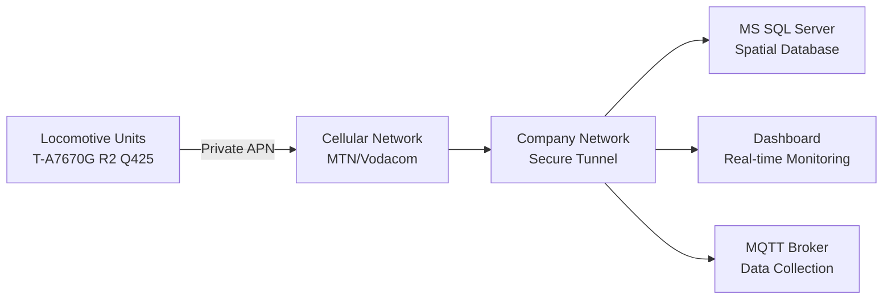
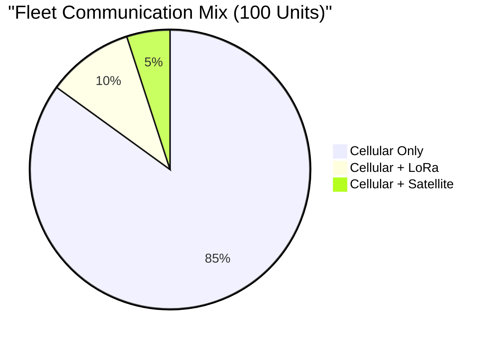
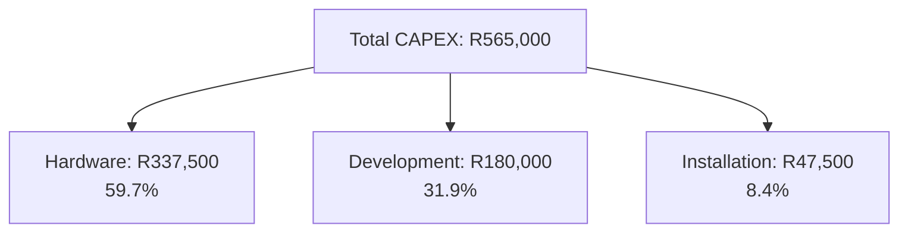
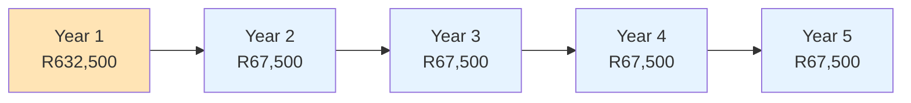
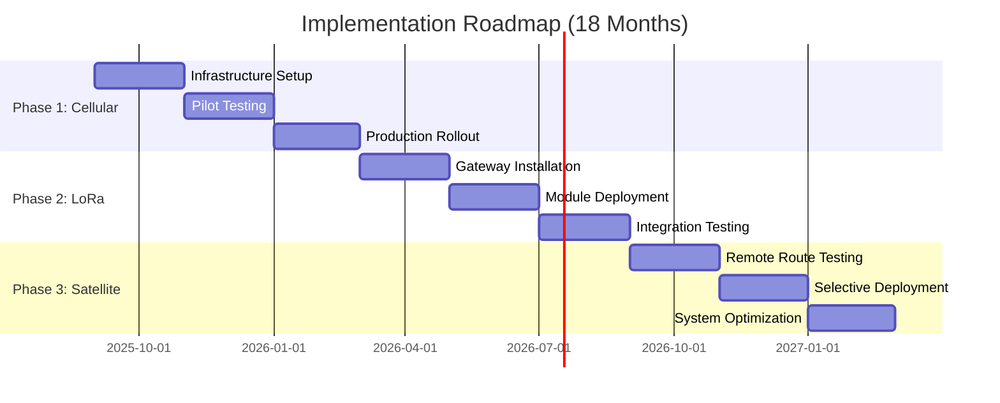
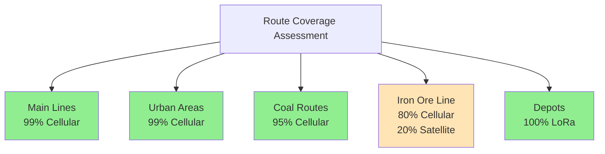
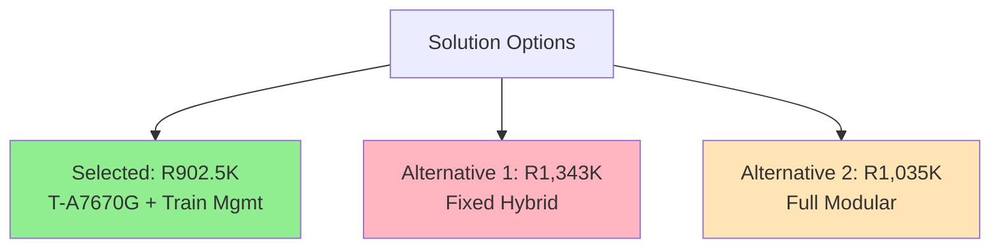
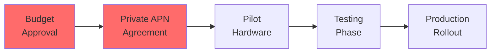
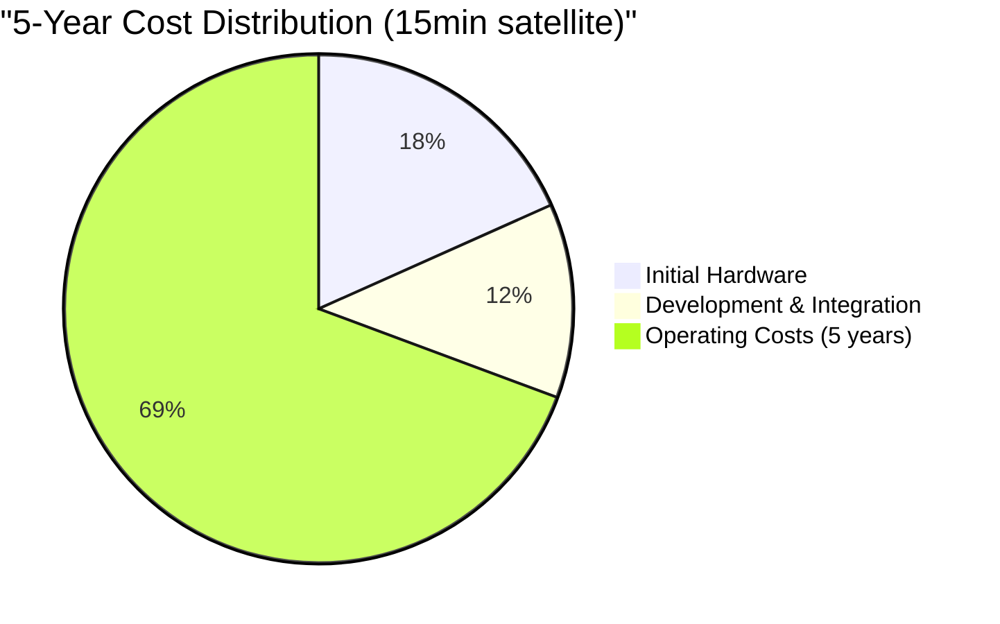

# Executive Summary
## South African Railway Locomotive GPS Tracking System

**Date:** September 2025  
**Project:** Fleet-wide GPS Tracking Implementation  
**Solution:** Cellular-Base with Modular Extension Capability  

---

## 1. Business Case

### Current Challenge
- **No real-time visibility** of 100+ locomotive fleet
- **Inefficient asset utilization** due to lack of tracking
- **Security risks** from unauthorized locomotive use
- **Maintenance delays** from poor location data

### Proposed Solution
Deploy GPS tracking units based on **LILYGO T-A7670G R2 Q425** platform with enhanced user interface, cellular connectivity, train management integration, and optional expansion modules for areas with poor coverage.

### Key Operational Improvements
| Benefit | Expected Improvement | Measurement |
|---------|---------------------|-------------|
| **Asset Utilization** | 15% reduction in idle time | GPS tracking data |
| **Fuel Efficiency** | 8% improvement | Route optimization |
| **Security** | 24/7 monitoring | Real-time alerts |
| **Maintenance** | 20% faster response | Location accuracy |

---

## 2. Technical Solution Overview

### System Architecture

### Hardware Configuration
| Component | Base Unit | Optional Modules |
|-----------|-----------|------------------|
| **Platform** | LILYGO T-A7670G R2 Q425 | Expansion Board |
| **Enhanced UI** | 2.8" Color TFT, 4-button nav, status LEDs | - |
| **Communication** | LTE CAT-1/3G/2G Cellular | LoRa 868MHz / Satellite |
| **GPS** | Multi-GNSS Integrated | - |
| **Power** | 110V Railway + 48hr Battery | - |
| **Cost** | R3,375 (includes enhanced UI) | R300-3,250 per module |

### Coverage Strategy

---

## 3. Budget Requirements

### Capital Expenditure (CAPEX)

### Detailed Cost Breakdown
| Category | Component | Cost |
|----------|-----------|------|
| **Hardware** | 100x Base Units @ R3,375 (includes enhanced UI + GPIO expander) | R337,500 |
| **Development** | Firmware, Backend & Train Management Integration | R180,000 |
| **Installation** | Labor & Testing | R47,500 |
| **Total CAPEX** | | **R565,000** |

### Operating Expenditure (OPEX)
| Service | Monthly Cost | Annual Cost |
|---------|--------------|-------------|
| **Cellular Connectivity (85 units)** | R4,250 | R51,000 |
| **Satellite Data (5 units @ 15min intervals)** | R16,545 | R198,540 |
| **Satellite Data (5 units @ 5min intervals)** | R46,920 | R563,040 |
| **System Maintenance** | R500 | R6,000 |
| **Total OPEX (15min satellite)** | **R21,295** | **R255,540** |
| **Total OPEX (5min satellite)** | **R51,670** | **R620,040** |

### 5-Year Total Cost of Ownership

**Total 5-Year Expenditure with 15min satellite intervals: R1,842,700**  
**Total 5-Year Expenditure with 5min satellite intervals: R3,665,200**

**⚠️ Critical Note**: Satellite communication costs are extremely high (R3,309-R9,384/month per unit). Recommend satellite use only for emergency/critical communications.

---

## 4. Implementation Timeline

### Deployment Milestones
| Phase | Timeline | Units | Capability | Budget |
|-------|----------|-------|------------|--------|
| **Phase 1** | Months 1-6 | 100 | Cellular tracking + train management operational | R565,000 |
| **Phase 2** | Months 7-12 | +30 modules | Depot cost optimization | R150,000 |
| **Phase 3** | Months 13-18 | +5 modules | Complete coverage | R75,000 |

---

## 5. Risk Assessment

### Risk Matrix
| Risk | Probability | Impact | Mitigation | Status |
|------|-------------|--------|------------|---------|
| **Cellular Coverage Gaps** | Medium | Medium | Add LoRa/Satellite modules | ✅ Addressed |
| **Private APN Setup** | Low | High | Early engagement with carriers | ⚠️ In Progress |
| **Hardware Failure** | Low | Low | 10% spare inventory | ✅ Planned |
| **Budget Overrun** | Low | Medium | Phased deployment | ✅ Controlled |
| **Technical Skills** | Medium | Low | Comprehensive training | ✅ Planned |

### Coverage Analysis

---

## 6. Key Success Factors

### Technical Advantages
✅ **Cost-Optimized Platform** - LILYGO T-A7670G R2 Q425 platform  
✅ **Power Efficient** - 65% power reduction vs alternatives (48-hour battery life)
✅ **Procurement Flexibility** - T-SIM7600G-H available as drop-in replacement
✅ **Immediate Deployment** - No infrastructure development required  
✅ **Modular Design** - Add capabilities only where needed  
✅ **Secure Connectivity** - Private APN to company network  
✅ **Future-Proof** - Expandable for new technologies
✅ **Path to Industrialization** - Architecture facilitates a future transition to a custom, industrial-grade PCB for mass production.

### Hardware Flexibility
**Primary Platform**: T-A7670G R2 Q425 (ESP32-WROVER-E + A7670G + L76K GPS)
- Cost effective at R3,375 per unit
- Better power efficiency (0.26W vs 0.65W idle)
- Direct battery operation capability

**Backup Platform**: T-SIM7600G-H (ESP32-WROVER-B + SIM7600G + integrated GPS)  
- Proven track record and extensive documentation
- Available if T-A7670G supply issues arise
- Requires minor firmware modifications for drop-in replacement  

### Operational Benefits
| Metric | Current State | Target State | Improvement |
|--------|--------------|--------------|-------------|
| **Fleet Visibility** | 0% | 100% | Complete tracking |
| **Response Time** | 4 hours | 30 minutes | 87% faster |
| **Route Optimization** | Manual | Automated | 15% efficiency |
| **Maintenance Planning** | Reactive | Predictive | 30% improvement |

---

## 7. Competitive Analysis

### Solution Comparison
| Criteria | Selected Solution | Alternative 1 | Alternative 2 |
|----------|------------------|---------------|---------------|
| **Approach** | Cellular + Modular | Fixed Hybrid | Full Modular |
| **Initial Cost** | R565K | R1,013K | R542K |
| **5-Year Total Cost** | R902.5K | R1,343K | R1,035K |
| **Deployment Time** | 6 months | 18 months | 12 months |
| **Flexibility** | High | Low | Very High |
| **Complexity** | Low | Medium | High |
| **Risk** | Low | Medium | Medium |

### Cost Efficiency Analysis

---

## 8. Recommendations

### Immediate Actions (Month 1)
1. **Approve budget** allocation of R565,000 CAPEX
2. **Engage network provider** for private APN setup
3. **Order pilot hardware** (10 T-A7670G units) for testing
4. **Assign project team** with IT and operations representatives
5. **Begin database setup** with MS SQL Server spatial extensions

### Critical Path Items

### Implementation Metrics
- **Month 3:** 10 pilot units operational
- **Month 6:** 100 units deployed with 99% uptime
- **Month 12:** Full depot coverage with LoRa
- **Month 18:** Complete system optimization

---

## 9. Budget Summary

### Total Project Expenditure (Conservative - 15min satellite intervals)
| Period | CAPEX | OPEX | Cumulative |
|--------|-------|------|------------|
| **Year 1** | R565,000 | R255,540 | R820,540 |
| **Year 2** | - | R255,540 | R1,076,080 |
| **Year 3** | - | R255,540 | R1,331,620 |
| **Year 4** | - | R255,540 | R1,587,160 |
| **Year 5** | - | R255,540 | R1,842,700 |

### Alternative: Aggressive satellite use (5min intervals)
| Period | CAPEX | OPEX | Cumulative |
|--------|-------|------|------------|
| **Year 1** | R565,000 | R620,040 | R1,185,040 |
| **Year 5** | - | R620,040 | R3,665,200 |

### Budget Allocation by Category

---

## 10. Conclusion

The proposed locomotive tracking system offers a **practical, scalable solution** that addresses current operational challenges through proven technology and phased implementation.

### Decision Factors
| Factor | Assessment |
|--------|------------|
| **Strategic Alignment** | ✅ Supports fleet modernization objectives |
| **Budget Requirements** | ✅ R565K initial + R67.5K annual |
| **Technical Risk** | ✅ Low - proven hardware platform |
| **Operational Impact** | ✅ Immediate visibility improvement |
| **Scalability** | ✅ Easily expanded to 1000+ units |

### Final Recommendation
**PROCEED WITH IMPLEMENTATION** - The solution provides:
- Immediate operational capability with minimal risk
- Reasonable budget requirements with controlled costs
- Flexibility for future optimization
- Clear path to fleet-wide visibility

---

*For detailed technical documentation, refer to the Implementation Guide.*  
*For questions, contact: Eduard.Reitmann@Transnet.net*