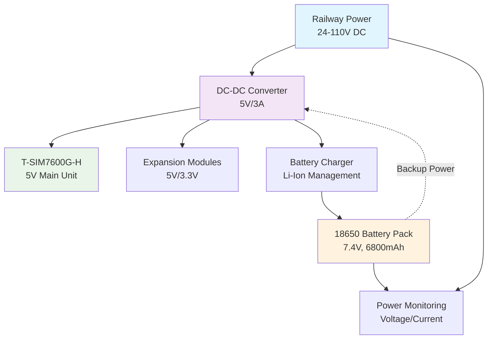
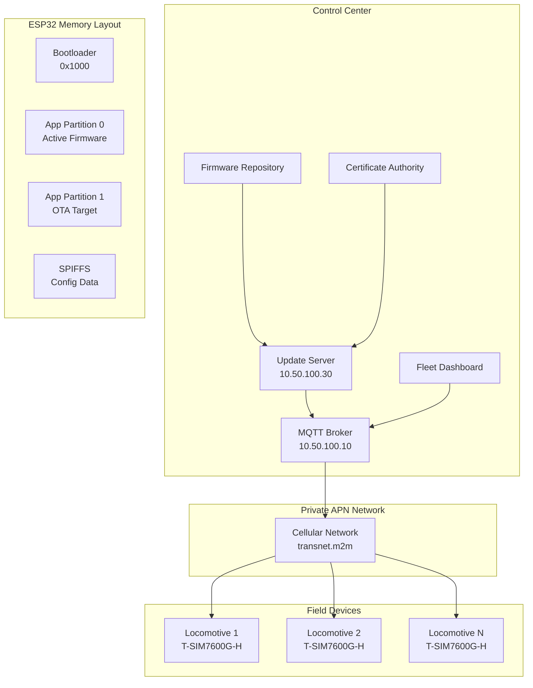
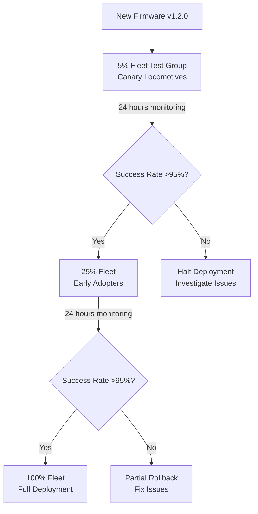
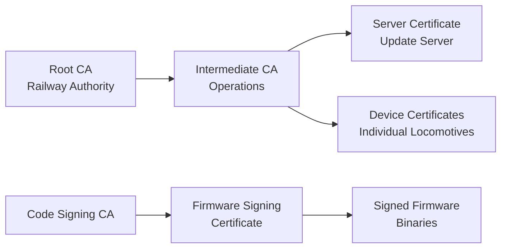

# South African Railway Locomotive GPS Tracking System
## Implementation Guide - Cellular-Base with Modular Extensions

---

## Executive Summary

This document provides comprehensive technical documentation for implementing a GPS tracking system using the LILYGO T-A7670G R2 Q425 as the base platform with enhanced user interface, train management integration, and optional expansion modules. The solution provides immediate cellular connectivity with complete train identification capabilities and the flexibility to add LoRa or satellite communication for areas with poor cellular coverage.

**Key Innovation:** Unlike a fixed hybrid system, this approach starts with proven cellular technology, adds complete train management integration with existing Transnet systems (ITP, TMS, VDU), and includes expansion modules only where operationally required, optimizing both deployment speed and total cost of ownership.

---

## 1. System Architecture

### 1.1 Core Design Principles
- **Cellular-first approach** - Immediate real-time tracking capability
- **Complete train management integration** - Direct connectivity with ITP, TMS, and VDU systems
- **Enhanced user interface** - 2.8" TFT display with train assignment workflow
- **Modular expansion** - Add communication methods as needed
- **Private network security** - APN configuration for company network
- **Graceful degradation** - Store-and-forward when offline
- **Single platform** - One hardware design, multiple configurations

### 1.2 Network Architecture

```
                FIELD DEVICES                           PRIVATE NETWORK
┌────────────────────────────────────────┐    ┌─────────────────────────┐
│                                        │    │                         │
│  Locomotive Unit #1 (Urban)            │    │   Company Data Center   │
│  └─ T-A7670G R2 Q425 (Cellular only)   │───►│                         │
│                                        │    │   ┌──────────────────┐  │
│  Locomotive Unit #2 (Depot)            │    │   │  MS SQL Server   │  │
│  └─ T-A7670G R2 Q425 + LoRa Module     │───►│   │  Spatial DB      │  │
│                                        │    │   └──────────────────┘  │
│  Locomotive Unit #3 (Remote)           │    │                         │
│  └─ T-A7670G R2 Q425 + Satellite Module│───►│   ┌──────────────────┐  │
│                                        │    │   │  MQTT Broker     │  │
│  Locomotive Unit #4 (Cross-border)     │    │   │  (Mosquitto)     │  │
│  └─ T-A7670G R2 Q425 + Sat + LoRa      │───►│   └──────────────────┘  │
│                                        │    │                         │
└────────────────────────────────────────┘    │   ┌──────────────────┐  │
                    │                         │   │  Web Dashboard   │  │
                    │                         │   │  (.NET Core)     │  │
            [Private APN Tunnel]              │   └──────────────────┘  │
                    │                         │                         │
                    ▼                         │   ┌──────────────────┐  │
         ┌──────────────────┐                 │   │  Active Directory│  │
         │ Cellular Network │                 │   │  Authentication  │  │
         │ MTN/Vodacom APN  │─────────────────│   └──────────────────┘  │
         └──────────────────┘                 │                         │
                                              └─────────────────────────┘
```

### 1.3 Communication Priority Logic

```cpp
// Automatic selection based on availability and cost
Priority 1: Cellular (if signal > -100 dBm)
Priority 2: LoRa (if gateway in range and cellular weak)
Priority 3: Satellite (if no terrestrial options)
Priority 4: Store & Forward (buffer until connection available)
```

---

## 2. Hardware Design

### 2.1 Base Configuration

| Component | Model | Unit Price (ZAR) | Quantity | Total | Purpose |
|-----------|--------|------------------|----------|--------|----------|
| **Main Board** | LILYGO T-A7670G R2 Q425 | R1,200 | 1 | R1,200 | ESP32-WROVER-E + LTE CAT-1 + L76K GPS |
| **TFT Display** | 2.8" Color TFT 320x240 | R350 | 1 | R350 | Enhanced UI display |
| **Button Assembly** | 4-button navigation pad | R80 | 1 | R80 | User interface control |
| **Status LEDs** | Multi-color LEDs x4 | R50 | 1 | R50 | Status indicators |
| **GPIO Expander** | MCP23017 I2C 16-port | R25 | 1 | R25 | Additional GPIO capacity |
| **UI Wiring Harness** | Connection cables | R50 | 1 | R50 | UI integration |
| **External Antenna** | LTE/GPS Combo Antenna | R200 | 1 | R200 | Enhanced reception |
| **Power Supply** | Simplified/Optional DC-DC | R150 | 1 | R150 | Direct battery or 3.7V to 5V |
| **Backup Battery** | 18650 Li-ion x2 | R120 | 1 | R120 | 48-hour backup |
| **Battery Management** | TP4056 + Protection | R50 | 1 | R50 | Charging circuit |
| **Storage** | 32GB Industrial SD | R150 | 1 | R150 | Local data logging |
| **Enclosure** | IP67 Railway Box (larger) | R450 | 1 | R450 | Environmental protection + UI panel |
| **Expansion Board** | Custom PCB with UI | R250 | 1 | R250 | Module interface + UI controller |
| **Connectors** | M12, terminal blocks | R100 | 1 | R100 | Robust connections |
| **Surge Protection** | TVS diodes, filters | R100 | 1 | R100 | Railway EMC |
| **TOTAL BASE** | | | | **R3,375** | **Complete base unit (includes enhanced UI + GPIO expander)** |

### 2.2 Expansion Modules

#### 2.2.1 LoRa Module (Optional)
| Component | Model | Price | Purpose |
|-----------|--------|-------|---------|
| **LoRa Chip** | SX1276 868MHz | R180 | Long-range communication |
| **Antenna** | 3dBi 868MHz | R70 | Optimized for SA ISM band |
| **Interface** | SPI connection | R50 | Connection to main board |
| **Total** | | **R300** | LoRa capability |

#### 2.2.2 Satellite Module (Optional)
| Component | Model | Price | Purpose |
|-----------|--------|-------|---------|
| **Swarm M138** | Satellite modem | R3,200 | Global coverage |
| **VHF Antenna** | Included | R0 | Satellite communication |
| **Interface** | UART connection | R50 | Connection to main board |
| **Total** | | **R3,250** | Satellite capability |

### 2.3 Platform Alternative

**LILYGO T-SIM7600G-H** can be used as a drop-in replacement for the T-A7670G:

#### High-Level Modification Requirements for T-SIM7600G-H
- **Cellular Interface**: Change AT command set from A7670G to SIM7600G commands
- **GPS Handling**: Use integrated GPS instead of separate L76K module  
- **Power Supply**: Add DC-DC converter for 5V operation instead of direct battery
- **Pin Mapping**: Update GPIO assignments for different module interface
- **Firmware Libraries**: Switch from A7670G to SIM7600G driver libraries
- **Cost Impact**: +R300 per unit, -65% power efficiency
- **BOM Changes**: Different main board (R1,500 vs R1,200), power supply (R350 vs R150)

### 2.4 Pin Assignments

```cpp
// T-A7670G R2 Q425 Pin Assignments with GPIO Expander Integration

// Built-in peripherals (already connected internally)
// GPS: L76K GPS module via dedicated UART
// Cellular: A7670G module communication
// SD Card: GPIO5 (CS), GPIO18 (CLK), GPIO19 (MISO), GPIO23 (MOSI)

// Enhanced UI - Direct ESP32 GPIO (high-speed requirements)
#define TFT_CS_PIN       GPIO32   // TFT display chip select
#define TFT_DC_PIN       GPIO33   // TFT display data/command
#define TFT_RST_PIN      GPIO25   // TFT display reset
#define TFT_BACKLIGHT    GPIO26   // TFT backlight control
// TFT uses shared SPI: GPIO14 (CLK), GPIO13 (MOSI), GPIO12 (MISO)

// Expansion modules
#define LORA_CS_PIN      GPIO15   // LoRa chip select
#define LORA_RST_PIN     GPIO4    // LoRa reset
#define LORA_IRQ_PIN     GPIO2    // LoRa interrupt
// LoRa uses shared SPI: GPIO14 (CLK), GPIO13 (MOSI), GPIO12 (MISO)

#define SAT_TX_PIN       GPIO16   // Satellite UART TX
#define SAT_RX_PIN       GPIO17   // Satellite UART RX
#define SAT_EN_PIN       GPIO21   // Satellite enable
#define SAT_STATUS_PIN   GPIO22   // Satellite status

// I2C Bus (shared by GPIO expander and sensors)
#define I2C_SDA_PIN      GPIO27   // I2C data line
#define I2C_SCL_PIN      GPIO14   // I2C clock line (shared with SPI CLK)

// System monitoring
#define BATTERY_ADC      GPIO35   // Battery voltage monitor
#define EXTERNAL_INT     GPIO34   // External interrupt
#define SYSTEM_LED       GPIO0    // Primary system status LED

// GPIO Expander Configuration
#define I2C_GPIO_ADDR    0x20     // MCP23017 I2C address

// GPIO Expander Pin Assignments (via I2C)
// Port A (Expander pins 0-7)
#define EXP_BTN_UP       0        // Navigation button up
#define EXP_BTN_DOWN     1        // Navigation button down  
#define EXP_BTN_OK       2        // Confirmation button
#define EXP_BTN_CANCEL   3        // Cancel/back button
#define EXP_LED_GPS      4        // GPS status LED
#define EXP_LED_CELLULAR 5        // Cellular connectivity LED
#define EXP_LED_TRAIN    6        // Train assignment status LED
#define EXP_SPARE_A7     7        // Spare expander pin

// Port B (Expander pins 8-15)
#define EXP_TRAIN_BUZZER 8        // Train assignment notification buzzer
#define EXP_DEBUG_LED    9        // Debug/maintenance LED
#define EXP_SPARE_B2     10       // Spare expander pin
#define EXP_SPARE_B3     11       // Spare expander pin
#define EXP_SPARE_B4     12       // Spare expander pin
#define EXP_SPARE_B5     13       // Spare expander pin
#define EXP_SPARE_B6     14       // Spare expander pin
#define EXP_SPARE_B7     15       // Spare expander pin
```

### 2.4 Power Management



**Power Consumption:**
- **Idle:** 70mA @ 3.7V (0.26W) - includes enhanced UI and GPIO expander
- **GPS Active:** 180mA @ 3.7V (0.67W) - includes display backlight
- **Cellular TX:** 1A @ 3.7V peak (3.7W)
- **LoRa TX:** 120mA @ 3.3V (0.4W)
- **Satellite TX:** 1A @ 5V (5W)
- **Enhanced UI Components:**
  - TFT Display: 40mA @ 3.3V (0.13W)
  - GPIO Expander: 1mA @ 3.3V (0.003W)
  - Status LEDs: 10mA @ 3.3V total (0.033W)

**Battery Life (6800mAh @ 7.4V = 50Wh):**
- **Cellular only:** 48 hours continuous operation (with enhanced UI active)
- **With LoRa:** 45 hours
- **With Satellite:** 35 hours
- **Sleep mode with UI off:** 72+ hours (display auto-off after inactivity)

---

## 3. Communication Protocols

### 3.1 Private APN Configuration

```cpp
// APN Settings for Private Network Access
const char* APN = "transnet.m2m";        // Private APN name
const char* APN_USER = "railway";        // APN username
const char* APN_PASS = "encrypted_pwd";  // APN password

// Network Configuration
const char* MQTT_SERVER = "10.50.100.10";  // Internal MQTT broker
const int MQTT_PORT = 8883;                // TLS port
const char* SQL_SERVER = "10.50.100.20";   // MS SQL Server (via API)
```

### 3.2 Data Transmission Format

#### 3.2.1 MQTT Message Structure
```json
{
  "deviceId": "LOCO-001",
  "timestamp": "2025-09-01T10:30:45Z",
  "position": {
    "latitude": -26.195246,
    "longitude": 28.034088,
    "altitude": 1680.5,
    "accuracy": 2.5,
    "speed": 45.6,
    "heading": 127.3
  },
  "telemetry": {
    "satellites": 12,
    "hdop": 0.9,
    "signalStrength": -75,
    "network": "Vodacom-4G",
    "battery": 85,
    "temperature": 28.5
  },
  "modules": {
    "cellular": "active",
    "lora": "standby",
    "satellite": "not_installed"
  }
}
```

#### 3.2.2 LoRa Message Format (Compressed)
```cpp
struct LoRaPacket {
    uint16_t deviceId;        // 2 bytes
    uint32_t timestamp;       // 4 bytes (epoch)
    int32_t latitude;         // 4 bytes (scaled integer)
    int32_t longitude;        // 4 bytes (scaled integer)
    uint16_t speedHeading;    // 2 bytes (packed)
    uint8_t status;           // 1 byte (bit flags)
    uint8_t battery;          // 1 byte (percentage)
};  // Total: 18 bytes
```

### 3.3 Store-and-Forward Protocol

```cpp
class DataManager {
    void handleDataTransmission(TelemetryData& data) {
        // Always store locally first
        sdCard.append(data);
        
        // Try primary communication
        if (cellular.isConnected()) {
            if (cellular.send(data)) {
                sdCard.markAsSent(data);
                return;
            }
        }
        
        // Try secondary if available
        if (loraModule.isInstalled() && loraModule.gatewayInRange()) {
            if (loraModule.send(compressData(data))) {
                sdCard.markAsSent(data);
                return;
            }
        }
        
        // Queue for retry
        retryQueue.add(data);
    }
};
```

---

## 4. Software Architecture

### 4.1 Embedded Firmware Structure

```
firmware/
├── src/
│   ├── main.cpp                 // Main application loop
│   ├── config/
│   │   ├── apn_settings.h       // Private APN configuration
│   │   ├── routes.h             // Route profiles
│   │   └── modules.h            // Module configurations
│   ├── core/
│   │   ├── gps_manager.cpp      // GPS handling
│   │   ├── cellular_manager.cpp // SIM7600G control
│   │   ├── power_manager.cpp    // Power optimization
│   │   └── storage_manager.cpp  // SD card operations
│   ├── modules/
│   │   ├── lora_module.cpp      // LoRa communication
│   │   ├── satellite_module.cpp // Satellite interface
│   │   └── module_interface.h   // Common interface
│   ├── communication/
│   │   ├── mqtt_client.cpp      // MQTT protocol
│   │   ├── data_compression.cpp // Message optimization
│   │   └── encryption.cpp       // TLS/security
│   └── utils/
│       ├── diagnostics.cpp      // Self-test routines
│       ├── ota_update.cpp       // Firmware updates
│       └── watchdog.cpp         // System monitoring
├── lib/
│   ├── TinyGPSPlus/            // GPS parsing
│   ├── PubSubClient/           // MQTT library
│   ├── LoRa/                   // LoRa library
│   └── ArduinoJson/            // JSON handling
└── platformio.ini              // Build configuration
```

### 4.2 Core Application Logic

```cpp
class LocomotiveTracker {
private:
    // Core components
    GPSManager gps;
    CellularManager cellular;
    StorageManager storage;
    PowerManager power;
    
    // Optional modules
    LoRaModule* lora = nullptr;
    SatelliteModule* satellite = nullptr;
    
    // Configuration
    RouteProfile currentRoute;
    DeviceConfig config;
    
public:
    void setup() {
        // Initialize base system
        Serial.begin(115200);
        initializeHardware();
        
        // Configure private APN
        cellular.configure(APN, APN_USER, APN_PASS);
        cellular.connect();
        
        // Detect expansion modules
        detectModules();
        
        // Load configuration
        loadConfiguration();
        
        // Start tracking
        gps.begin();
        
        // Register with backend
        registerDevice();
    }
    
    void loop() {
        // Collect telemetry
        TelemetryData data = collectTelemetry();
        
        // Determine update interval based on movement
        uint32_t interval = calculateInterval(data.speed);
        
        // Store locally
        storage.log(data);
        
        // Transmit using best available method
        transmitData(data);
        
        // Power management
        if (interval > 60000) {
            power.enterDeepSleep(interval);
        } else {
            delay(interval);
        }
    }
    
private:
    void detectModules() {
        // Check for LoRa module on SPI bus
        if (checkSPIDevice(LORA_CS_PIN)) {
            lora = new LoRaModule(LORA_CS_PIN, LORA_RST_PIN, LORA_IRQ_PIN);
            lora->initialize();
            Serial.println("LoRa module detected");
        }
        
        // Check for Satellite module on UART
        if (checkUARTDevice(SAT_TX_PIN, SAT_RX_PIN)) {
            satellite = new SatelliteModule(SAT_TX_PIN, SAT_RX_PIN);
            satellite->initialize();
            Serial.println("Satellite module detected");
        }
    }
    
    uint32_t calculateInterval(float speed) {
        if (speed < 1.0) return 600000;   // 10 min when stationary
        if (speed < 20.0) return 300000;  // 5 min when slow
        if (speed < 60.0) return 120000;  // 2 min when moderate
        return 60000;                     // 1 min when fast
    }
    
    void transmitData(TelemetryData& data) {
        bool transmitted = false;
        
        // Try cellular first (private APN)
        if (cellular.isConnected()) {
            String json = serializeToJson(data);
            if (mqtt.publish("telemetry/locomotive", json)) {
                transmitted = true;
                updateDashboard(data);
            }
        }
        
        // Fallback to LoRa if available and cellular failed
        if (!transmitted && lora && lora->gatewayInRange()) {
            LoRaPacket packet = compressData(data);
            if (lora->send(packet)) {
                transmitted = true;
            }
        }
        
        // Last resort: satellite (if installed)
        if (!transmitted && satellite && data.priority == HIGH) {
            if (satellite->send(data)) {
                transmitted = true;
            }
        }
        
        // Queue for retry if all failed
        if (!transmitted) {
            storage.queueForRetry(data);
        }
    }
};
```

### 4.3 Backend Architecture

```csharp
// .NET Core Web API Structure
namespace RailwayTracking.API
{
    public class TelemetryController : ControllerBase
    {
        private readonly SqlContext _db;
        private readonly IHubContext<TrackingHub> _hub;
        
        [HttpPost("telemetry")]
        public async Task<IActionResult> ReceiveTelemetry(TelemetryData data)
        {
            // Validate device authentication (via APN)
            if (!IsValidDevice(data.DeviceId))
                return Unauthorized();
            
            // Store in SQL Server
            var entity = MapToEntity(data);
            _db.LocationHistory.Add(entity);
            await _db.SaveChangesAsync();
            
            // Update real-time dashboard
            await _hub.Clients.All.SendAsync("LocationUpdate", data);
            
            // Check geofencing rules
            await CheckGeofencing(data);
            
            return Ok();
        }
    }
}
```

---

## 5. Over-the-Air (OTA) Update System

The system implements comprehensive OTA capabilities for remote firmware management across the entire locomotive fleet, addressing one of the key operational requirements identified during extended research.

### 5.1 OTA Architecture Overview



### 5.2 Fleet Deployment Strategies

#### Canary Deployment (Recommended)


#### Geographic Rollout
- **Gauteng Routes**: High-traffic main lines (30% of fleet)
- **Western Cape**: Secondary routes (25% of fleet) 
- **KwaZulu-Natal**: Mixed traffic (25% of fleet)
- **Remote Routes**: Low-traffic areas (20% of fleet)

### 5.3 OTA Security Framework

#### Multi-Layer Security Model
1. **Transport Security**: HTTPS/TLS 1.3 with certificate pinning
2. **Authentication**: Device certificates and private key authentication  
3. **Firmware Signing**: RSA-4096 signed firmware binaries
4. **Version Control**: Anti-rollback protection with secure versioning
5. **Integrity Validation**: SHA-256 checksums with signature verification

#### Certificate Management


### 5.4 Update Process Flow

#### Phase 1: Update Discovery
```cpp
// Periodic version check via cellular
void checkForUpdates() {
    HTTPClient https;
    https.begin(gsm_client, "https://10.50.100.30/api/version");
    https.addHeader("X-Device-ID", DEVICE_ID);
    https.addHeader("X-Current-Version", FIRMWARE_VERSION);
    
    if (https.GET() == 200) {
        StaticJsonDocument<256> response;
        deserializeJson(response, https.getString());
        
        const char* latest = response["version"];
        if (isNewerVersion(latest)) {
            scheduleUpdate(response["url"], response["checksum"]);
        }
    }
}
```

#### Phase 2: Secure Download
- **Bandwidth Management**: Throttled downloads to prevent network congestion
- **Resume Capability**: Partial download recovery on connection loss
- **Verification**: Real-time hash calculation during download
- **Progress Reporting**: MQTT status updates to fleet dashboard

#### Phase 3: Installation & Validation
```cpp
void performOTAUpdate() {
    // Pre-update validation
    if (!validateUpdateConditions()) return;
    
    // Download to inactive partition
    esp_ota_handle_t ota_handle;
    const esp_partition_t* update_partition = esp_ota_get_next_update_partition(NULL);
    
    // Secure download with verification
    if (downloadAndVerifyFirmware(update_partition, &ota_handle)) {
        esp_ota_end(ota_handle);
        esp_ota_set_boot_partition(update_partition);
        
        // Schedule self-test after reboot
        schedulePostUpdateValidation();
        ESP.restart();
    }
}
```

### 5.5 Rollback and Recovery

#### Automatic Rollback Triggers
- **Boot Failure**: No successful boot within 3 attempts
- **Self-Test Failure**: GPS, cellular, or MQTT connectivity failure
- **Watchdog Timeout**: System hang or infinite loop detection
- **Critical Error**: Memory corruption or stack overflow

#### Recovery Process
```cpp
void validateNewFirmware() {
    bool system_healthy = true;
    
    // Test critical subsystems
    system_healthy &= testGPSFunctionality();
    system_healthy &= testCellularConnectivity();
    system_healthy &= testMQTTConnection();
    system_healthy &= testMemoryIntegrity();
    
    if (system_healthy) {
        esp_ota_mark_app_valid_cancel_rollback();
        reportUpdateSuccess();
    } else {
        // Automatic rollback
        esp_ota_mark_app_invalid_rollback_and_reboot();
    }
}
```

### 5.6 Fleet Management Interface

#### Dashboard Capabilities
- **Fleet Overview**: Real-time firmware version distribution
- **Update Progress**: Live deployment status and progress tracking  
- **Health Monitoring**: System status of each locomotive post-update
- **Rollback Control**: Emergency rollback capability for individual or groups
- **Audit Trail**: Complete history of all update activities

#### MQTT Command Structure
```json
{
  "fleet_update_command": {
    "target": "fleet/group/gauteng",
    "version": "2.1.0", 
    "url": "https://10.50.100.30/firmware/v2.1.0/locomotive-fw.bin",
    "checksum": "sha256:a1b2c3d4...",
    "strategy": "staged",
    "delay_seconds": 300,
    "conditions": {
      "min_battery": 50,
      "max_speed": 5,
      "signal_strength": -90
    }
  }
}
```

### 5.7 Performance Metrics

#### Update Success Criteria
- **Download Success Rate**: >98% first attempt
- **Installation Success Rate**: >99.5% without rollback
- **Network Impact**: <10% bandwidth utilization during updates
- **Update Duration**: 45-90 seconds complete cycle
- **Fleet Availability**: >95% operational during staged rollouts

#### Monitoring and Alerting  
```cpp
struct OTAMetrics {
    uint32_t downloads_attempted;
    uint32_t downloads_successful; 
    uint32_t installations_successful;
    uint32_t rollbacks_triggered;
    uint32_t average_download_time_ms;
    uint32_t average_install_time_ms;
    float success_rate_percent;
};
```

### 5.8 Integration with Existing Systems

#### Database Integration
The OTA system integrates with the existing MS SQL Server database to track:
- Firmware version history per locomotive
- Update deployment schedules and results
- Performance metrics and failure analysis
- Audit trails for compliance reporting

#### MQTT Integration
OTA commands and status reporting utilize the existing MQTT infrastructure:
- **Command Topics**: `fleet/{group}/update`, `fleet/{device}/update`
- **Status Topics**: `fleet/status/{device}`, `fleet/update/progress`
- **Priority Handling**: Emergency updates bypass normal scheduling

### 5.9 Testing Framework

#### Pre-Deployment Validation
1. **Firmware Validation**: Signature verification and compatibility checking
2. **Network Testing**: Cellular connectivity and download speed validation
3. **Partition Testing**: Flash memory integrity and partition alignment
4. **Recovery Testing**: Rollback mechanism and watchdog functionality

#### Field Testing Protocol  
- **Test Group**: 5 locomotives across different routes
- **Duration**: 4 weeks comprehensive testing
- **Scenarios**: Normal operation, power cycling, network interruption
- **Success Criteria**: 100% successful updates with zero rollbacks

---

## 6. Database Schema

### 6.1 MS SQL Server Tables

```sql
-- Core tracking tables for private network deployment
CREATE TABLE Devices (
    DeviceID INT IDENTITY PRIMARY KEY,
    IMEI NVARCHAR(20) UNIQUE,
    LocomotiveNumber NVARCHAR(50),
    InstallDate DATETIME2,
    ModulesInstalled NVARCHAR(100),
    IsActive BIT DEFAULT 1,
    LastSeen DATETIME2,
    CurrentRoute NVARCHAR(100)
);

CREATE TABLE LocationHistory (
    ID BIGINT IDENTITY PRIMARY KEY,
    DeviceID INT FOREIGN KEY REFERENCES Devices(DeviceID),
    Timestamp DATETIME2,
    Position GEOGRAPHY,  -- Spatial data type
    Speed FLOAT,
    Heading FLOAT,
    Altitude FLOAT,
    Satellites INT,
    HDOP FLOAT,
    CommunicationMethod NVARCHAR(20), -- 'Cellular', 'LoRa', 'Satellite'
    SignalStrength INT,
    Battery INT,
    Temperature FLOAT,
    INDEX IX_Location_Time (DeviceID, Timestamp) INCLUDE (Position)
);

CREATE TABLE NetworkEvents (
    EventID BIGINT IDENTITY PRIMARY KEY,
    DeviceID INT FOREIGN KEY REFERENCES Devices(DeviceID),
    Timestamp DATETIME2,
    EventType NVARCHAR(50),
    Details NVARCHAR(500),
    NetworkType NVARCHAR(20),
    SignalQuality INT
);

CREATE TABLE Routes (
    RouteID INT IDENTITY PRIMARY KEY,
    RouteName NVARCHAR(100),
    RouteGeometry GEOGRAPHY,  -- Spatial line
    PreferredComm NVARCHAR(20),
    UpdateInterval INT,
    GeofenceBuffer INT  -- meters
);

-- Stored procedure for efficient spatial queries
CREATE PROCEDURE GetLocomotivesInArea
    @Area GEOGRAPHY,
    @TimeWindow INT = 60  -- minutes
AS
BEGIN
    SELECT 
        d.LocomotiveNumber,
        l.Position.STAsText() as CurrentPosition,
        l.Speed,
        l.Heading,
        l.Timestamp,
        l.CommunicationMethod
    FROM LocationHistory l
    INNER JOIN Devices d ON l.DeviceID = d.DeviceID
    WHERE l.Position.STIntersects(@Area) = 1
        AND l.Timestamp > DATEADD(MINUTE, -@TimeWindow, GETUTCDATE())
        AND l.ID IN (
            SELECT MAX(ID) FROM LocationHistory 
            GROUP BY DeviceID
        )
END
```

---

## 7. Implementation Timeline

### 6.1 Phase 1: Cellular Deployment (Months 1-6)

**Month 1-2: Infrastructure Setup**
- Configure private APN with MTN/Vodacom
- Setup MS SQL Server database
- Deploy MQTT broker on company network
- Develop base firmware

**Month 3-4: Pilot Testing**
- Deploy 10 units on test locomotives
- Validate private network connectivity
- Test data flow to SQL Server
- Refine power management

**Month 5-6: Production Rollout**
- Manufacture 100 base units
- Installation on priority locomotives
- Dashboard deployment
- Staff training

**Budget:** R565,000 (hardware + development + train management integration)

### 6.2 Phase 2: LoRa Extension (Months 7-12)

**Month 7-8: Gateway Infrastructure**
- Install LoRa gateways at 5 major depots
- Configure gateway-to-network bridges
- Test LoRa-cellular handover

**Month 9-10: Module Deployment**
- Add LoRa modules to 30 depot locomotives
- Validate cost savings from free communication
- Optimize duty cycle management

**Month 11-12: Integration**
- Full system integration testing
- Performance optimization
- Documentation update

**Budget:** R150,000 (gateways + modules)

### 6.3 Phase 3: Satellite Extension (Months 13-18)

**Month 13-14: Satellite Testing**
- Procure 5 Swarm modules for testing
- Validate coverage on Iron Ore line
- Assess latency impact

**Month 15-16: Selective Deployment**
- Install satellite modules on remote route locomotives
- Configure multi-path communication
- Test failover scenarios

**Month 17-18: Optimization**
- Fine-tune module selection algorithms
- Complete coverage analysis
- Final system acceptance

**Budget:** R400,000 (satellite modules for emergency use only due to high operational costs)

### Phase 4: Industrialization (Optional, Post-Prototype)

Upon successful validation of the prototype, this optional phase focuses on developing a custom, industrial-grade PCB for mass production and enhanced environmental robustness.

#### Phase 4.1: Industrial Carrier Board Design (Months 6-9)

- **Objective**: Design a custom carrier board for a production-level device.
- **Core Components**:
  - **Quectel BG95-M3**: A multi-mode cellular module with 2G fallback, essential for South African coverage gaps and proven for industrial reliability.
  - **ESP32-S3-WROOM-1**: An industrial-grade version of the ESP32, rated for -40°C to 85°C.
  - **M12 Connectors**: For robust, sealed connections for power and satellite module expansion.
  - **Conformal Coating**: To protect all boards from moisture and contaminants.
- **Power System**: Design an EN50155 compliant power management system with a wide input range (24-110VDC), isolated DC-DC converters, and a supercapacitor for graceful shutdowns.

#### Phase 4.2: Production and Deployment

- **Objective**: Manufacture and deploy the industrial-grade units.
- **Manufacturing**: Partner with a PCB assembly house for automated manufacturing and testing.
- **Railway-Specific Features**:
  - **Protection**: Integrate TVS diodes on all I/O, isolated RS485 for train bus communication, and an external watchdog timer.
  - **Memory**: Utilize FRAM (256KB) for high-endurance data logging and EEPROM (32KB) for configuration backup.
- **Rollout**: Replace prototype units with the new industrial hardware in a phased deployment.

---

## 8. Testing & Validation

### 7.1 Hardware Testing

```cpp
// Self-test routine for production units
bool performSelfTest() {
    Serial.println("Starting self-test...");
    
    // Test cellular modem
    if (!testCellularModem()) {
        Serial.println("ERROR: Cellular modem failed");
        return false;
    }
    
    // Test GPS
    if (!testGPS()) {
        Serial.println("ERROR: GPS failed");
        return false;
    }
    
    // Test SD card
    if (!testSDCard()) {
        Serial.println("ERROR: SD card failed");
        return false;
    }
    
    // Test optional modules
    if (lora && !lora->selfTest()) {
        Serial.println("WARNING: LoRa module issues");
    }
    
    if (satellite && !satellite->selfTest()) {
        Serial.println("WARNING: Satellite module issues");
    }
    
    // Test private APN connection
    if (!testAPNConnection()) {
        Serial.println("ERROR: Cannot connect to private APN");
        return false;
    }
    
    Serial.println("Self-test PASSED");
    return true;
}
```

### 7.2 Network Testing

**Private APN Validation:**
- Verify tunnel establishment
- Test internal server accessibility
- Validate firewall rules
- Confirm data routing

**Coverage Testing:**
- Main routes cellular signal mapping
- LoRa gateway range verification
- Dead zone identification
- Failover scenario validation

---

## 9. Security Considerations

### 8.1 Network Security

**Private APN Benefits:**
- Isolated from public internet
- Direct tunnel to company network
- No exposure to external attacks
- Centralized access control

**Implementation:**
```cpp
// TLS Configuration for MQTT
const char* CA_CERT = R"(
-----BEGIN CERTIFICATE-----
[Company CA Certificate]
-----END CERTIFICATE-----
)";

WiFiClientSecure secureClient;
secureClient.setCACert(CA_CERT);
mqttClient.setClient(secureClient);
```

### 8.2 Device Security

**Security Measures:**
- Unique device certificates
- Encrypted storage on SD card
- Secure boot implementation
- OTA signature verification
- Physical tamper detection

---

## 10. Operational Procedures

### 9.1 Installation Process

1. **Pre-Installation:**
   - Register device IMEI with private APN
   - Configure device ID in database
   - Assign to locomotive

2. **Physical Installation:**
   - Mount in electrical cabinet
   - Connect to 110V locomotive power
   - Install external antenna on roof
   - Secure all connections

3. **Commissioning:**
   - Power on and run self-test
   - Verify GPS lock
   - Confirm private APN connection
   - Test data flow to SQL Server
   - Document installation

### 9.2 Field Debugging and Data Extraction

The system includes a comprehensive WiFi Access Point-based debug mode that enables field technicians to extract data and perform diagnostics without physical connections to the device.

#### 9.2.1 Debug Mode Overview

Debug mode creates a temporary WiFi Access Point that provides:
- Complete access to on-board SD card data and logs
- Real-time system status and diagnostics
- Browser-based interface for manual data extraction
- Python API for automated data collection
- Secure, audited access with session timeouts

#### 9.2.2 Activation Procedures

**Primary Activation Method (Hardware):**
1. Approach the locomotive tracking device
2. Hold OK+Cancel buttons simultaneously for 3 seconds
3. Watch for Enhanced UI confirmation screen showing WiFi credentials
4. Listen for three confirmation beeps
5. Observe system LED change to blue flashing pattern

**Secondary Activation Method (Menu):**
1. Navigate to Main Menu using button navigation
2. Select "Debug Mode" option
3. Confirm activation on confirmation screen
4. Follow same visual and audio confirmation as hardware method

**WiFi Access Point Configuration:**
- **SSID**: `LOCO-{DEVICE_ID}-DEBUG` (e.g., "LOCO-001234-DEBUG")
- **Password**: `{DEVICE_ID}{YYYYMMDD}` (daily rotation, e.g., "00123420250904")
- **IP Address**: `192.168.4.1`
- **Maximum Clients**: 4 concurrent connections
- **Session Timeout**: 30 minutes inactivity, 2 hours maximum duration

#### 9.2.3 Data Extraction Procedures

**Browser-Based Access:**
1. Connect laptop/tablet to debug WiFi network using displayed credentials
2. Navigate to `http://192.168.4.1` in web browser
3. Access features:
   - **File Browser**: Navigate SD card directory structure
   - **Log Viewer**: Real-time log streaming and historical access
   - **System Status**: Live GPS, cellular, train assignment data
   - **Bulk Download**: Create ZIP archives of selected files/folders
   - **Configuration Viewer**: Current device settings (read-only)

**Python Script Automation:**
```bash
# Example automated data extraction
python3 extract_data.py 192.168.4.1 --all
python3 extract_data.py 192.168.4.1 --logs --config
```

**Available REST API Endpoints:**
- `GET /api/system/info` - Device information and uptime
- `GET /api/system/status` - Real-time system status
- `GET /api/files` - List all files and directories
- `GET /api/files/{path}` - Download specific file
- `POST /api/files/archive` - Create ZIP archive
- `GET /api/logs` - Available log files
- `GET /api/logs/{type}` - Specific log type (system, gps, cellular, train)
- `GET /api/config` - Current device configuration (read-only)

#### 9.2.4 Field Technician Workflow

1. **Approach Device**: Locate locomotive tracking unit in electrical cabinet
2. **Safety Check**: Ensure power is stable and system is operational
3. **Activate Debug Mode**: Use hardware button combination (OK+Cancel 3 seconds)
4. **Verify Activation**: Check display for WiFi credentials and status confirmation
5. **Connect Equipment**: Join debug WiFi network from field laptop
6. **Extract Data**: Use browser interface or Python scripts as required
7. **Document Session**: Note any issues, data extracted, session duration
8. **Exit Cleanly**: Press EXIT button or wait for auto-timeout
9. **Verify Normal Operation**: Confirm device returns to normal tracking mode

#### 9.2.5 Data Organization on Device

Debug mode provides access to organized SD card structure:

```
/data/
├── logs/
│   ├── system/          # System logs by date (YYYY-MM-DD.log)
│   ├── gps/             # GPS tracking data and positioning logs
│   ├── cellular/        # Cellular connection and network logs
│   ├── train/           # Train assignment history and workflow logs
│   └── debug/           # Debug session logs and access history
├── config/
│   ├── device.json      # Device configuration backup
│   ├── routes.json      # Route profile data and boundaries
│   ├── gpio_state.json  # GPIO and expander configuration
│   └── calibration.json # Sensor calibration and offset data
├── exports/
│   ├── daily/           # Daily data exports and summaries
│   └── sessions/        # Debug session data exports
└── temp/
    └── debug_archives/  # Temporary ZIP files for bulk downloads
```

#### 9.2.6 Security and Audit Controls

**Access Security:**
- Daily password rotation prevents unauthorized access
- Session timeouts limit exposure window
- Maximum 4 concurrent client connections
- All debug sessions logged to audit trail
- Read-only access prevents configuration tampering

**Audit Logging:**
- Debug session start/end times
- Client connections and IP addresses
- Files accessed and downloaded
- Total data transferred
- Session termination reason (manual exit, timeout, error)

**Session Summary Display:**
After debug session completion, Enhanced UI shows:
- Session duration and data transferred
- Number of clients connected
- Files accessed and downloaded
- Confirmation that session logged to audit trail

#### 9.2.7 Troubleshooting Debug Mode

**Common Issues and Solutions:**

| Issue | Probable Cause | Solution |
|-------|----------------|----------|
| WiFi AP not visible | Button activation failed | Ensure OK+Cancel held for full 3 seconds |
| Cannot connect to AP | Wrong password format | Use {DEVICE_ID}{YYYYMMDD} format |
| Web interface won't load | Firewall blocking access | Check client firewall, use http:// not https:// |
| File downloads failing | Session timeout | Complete downloads within 30-minute limit |
| Debug mode won't activate | GPIO expander communication issue | Check I2C connections, review system logs |

**Debug Mode Diagnostic Tests:**
```bash
# Test debug mode functionality during development
pio test -e debug-mode-activation    # Hardware activation test
pio test -e debug-wifi-ap            # WiFi AP functionality
pio test -e debug-web-server         # Web server endpoints
pio test -e debug-file-operations    # File access and downloads
pio test -e debug-security           # Security and session management
```


#### 9.2.8 Integration with Maintenance Procedures

Debug mode supports various maintenance scenarios:

**Routine Maintenance:**
- Monthly data extraction for trend analysis
- Configuration backup before system updates
- Performance monitoring and diagnostics

**Troubleshooting:**
- Real-time log access during issue investigation
- Historical data analysis for intermittent problems
- Network connectivity diagnostics

**Compliance and Auditing:**
- Complete operational history extraction
- Train assignment audit trails
- System configuration documentation

### 9.3 Maintenance Procedures

**Regular Maintenance:**
- Monthly: Check dashboard for all units reporting
- Quarterly: Verify antenna connections
- Annually: Replace backup battery
- As needed: Add/swap communication modules

**Troubleshooting Guide:**
| Issue | Check | Solution |
|-------|-------|----------|
| No GPS | Antenna connection | Reconnect/replace antenna |
| No cellular | APN configuration | Verify SIM and APN settings |
| No data | Private network | Check VPN tunnel status |
| Module not detected | Connections | Reseat module connectors |

---

## 11. Cost Analysis

### 10.1 Total Cost Breakdown (100 Units)

**Initial Investment:**
| Item | Cost |
|------|------|
| Base hardware (100 units) | R337,500 |
| Development & integration | R180,000 |
| Installation | R47,500 |
| **Total CAPEX** | **R565,000** |

**Monthly Operating Costs:**
| Service | Units | Cost/Unit | Total |
|---------|-------|-----------|-------|
| Cellular Connectivity | 85 | R50 | R4,250 |
| Satellite Data (15min intervals) | 5 | R3,309 | R16,545 |
| Satellite Data (5min intervals) | 5 | R9,384 | R46,920 |
| System Maintenance | 1 | R500 | R500 |
| **Total OPEX (15min satellite)** | | | **R21,295/month** |
| **Total OPEX (5min satellite)** | | | **R51,670/month** |

**Critical Note:** Satellite costs are extremely high (R3,309-R9,384/month per unit). Satellite communication should be used only for emergency/critical situations in areas with no cellular coverage.

---

## 12. Future Enhancements

### 11.1 Planned Upgrades

**Year 2:**
- AI-based predictive maintenance
- Integration with wagon tracking
- Driver behavior monitoring
- Fuel consumption tracking

**Year 3:**
- 5G module development
- Edge computing capabilities
- Blockchain-based audit trail
- Advanced analytics dashboard

**Year 4+: Future Satellite Technologies**
- Starlink integration module (when available in South Africa)
- Cost-effective satellite connectivity alternative to traditional services
- High-bandwidth satellite communication for advanced features

### Starlink Integration Potential

**Modular Architecture Advantage**: The system's modular design enables seamless integration with Starlink satellite internet once available in South Africa, without requiring changes to the base hardware platform.

**Key Benefits:**
- **Cost Efficiency**: Potential for significantly lower costs compared to current satellite options (Iridium: R3,309-R9,384/month per unit)
- **High Performance**: High-speed, low-latency connectivity enabling advanced features
- **Global Coverage**: Seamless cross-border operation without roaming charges
- **Future-Proof**: Expansion module approach allows immediate adoption when available
- **Enhanced Capabilities**: Support for real-time video, large data transfers, and advanced diagnostics

**Implementation Timeline**: Starlink expansion module development can commence once service launches in South Africa, with minimal impact on existing deployments.

### 11.2 Scalability

**System Capacity:**
- Current: 100 locomotives
- Expandable to: 1,000+ units
- Database: Petabyte-scale ready
- Dashboard: Real-time for 500+ units

---

## Conclusion

This implementation provides a practical, cost-effective solution for railway locomotive tracking that:

1. **Delivers immediate value** through cellular connectivity
2. **Maintains security** via private APN to company network
3. **Offers flexibility** to add modules where needed
4. **Optimizes costs** through selective technology deployment
5. **Ensures reliability** with proven hardware platform

The phased approach allows for controlled deployment, risk mitigation, and continuous optimization based on operational data.

**Key Success Factors:**
- Private APN configuration for secure connectivity
- Modular design for future expansion
- Store-and-forward for reliability
- Comprehensive testing procedures
- Clear operational procedures

**Next Steps:**
1. Finalize private APN agreement with network provider
2. Order development hardware for prototype
3. Setup test environment with SQL Server
4. Begin firmware development
5. Plan pilot deployment routes

---

*This implementation guide will be continuously updated as the project progresses through each phase.*