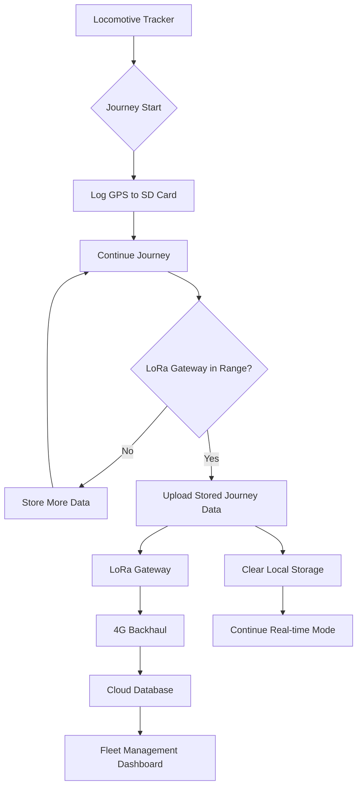
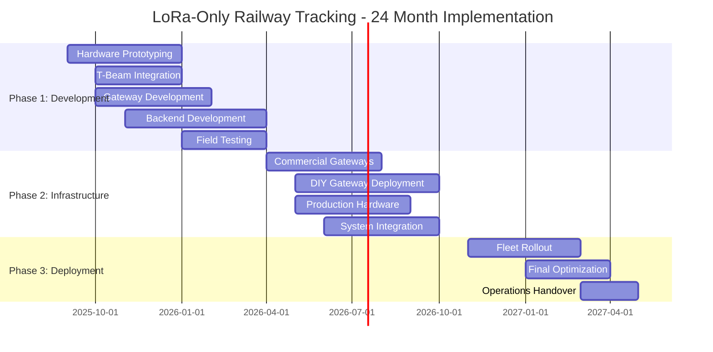

# South African Railway Locomotive GPS Tracking System
## LoRa-Only Store-and-Forward Implementation Guide (Variant 2)

---

## Executive Summary

**Project Goal:** Develop a cost-effective, LoRa-only GPS tracking system for locomotive fleet management across the South African rail network, utilizing store-and-forward data collection with strategic gateway deployment.

**Solution Approach:** ESP32-based tracking devices with LoRa communication, local SD card storage, and data upload only when in range of LoRa gateways positioned at strategic railway locations.

**Total Investment:** R1,550 per unit hardware + R0/month operational costs

**Deployment Timeline:** 24 months for 100-unit rollout with gateway infrastructure

---

## 1. Feasibility Analysis

### 1.1 Pros of LoRa-Only Approach ✅

**Cost Advantages:**
- **Zero recurring data costs** after gateway deployment
- **Reduced hardware complexity** - no cellular modems required
- **Lower power consumption** - devices can run for years on battery
- **No SIM card management** or monthly cellular subscriptions
- **Gateway infrastructure scales** - one gateway serves multiple locomotives

**Technical Benefits:**
- **Extended battery life:** LoRaWAN devices can achieve battery life of up to 15 years due to low power consumption
- **Excellent range:** Over 14.5 kilometers in suburban areas, up to 4.8 kilometers in urban areas
- **Penetration capabilities:** Better building/terrain penetration than cellular
- **Network independence:** No reliance on cellular operators
- **Scalability:** A single LoRa gateway can connect to thousands of end nodes

**Operational Advantages:**
- **Simplified deployment** - no SIM provisioning or cellular contracts
- **Reduced complexity** - fewer network dependencies
- **Better depot coverage** - ideal for yard and maintenance facility monitoring
- **Historical data retention** - complete journey logs stored locally

### 1.2 Cons of LoRa-Only Approach ⚠️

**Coverage Limitations:**
- **Duty cycle restrictions:** South Africa has 1% duty cycle limit (~75 messages/day max)
- **Gateway dependency** - no data upload without LoRa gateway proximity
- **Limited real-time capability** - data only available when in gateway range
- **Infrastructure investment** - requires building gateway network

**Technical Constraints:**
- **Payload limitations:** Maximum 100 bytes per message
- **Update frequency limitations** - cannot provide frequent position updates
- **No emergency communications** - cannot send immediate alerts
- **Weather sensitivity** - some signal attenuation in heavy rain

**Operational Challenges:**
- **Delayed incident response** - no real-time alerts for emergencies
- **Route deviation detection delayed** - alerts only when reaching gateway
- **Limited asset security** - no immediate theft notifications
- **Data gaps** - potential for missed journeys in low-coverage areas

### 1.3 Regulatory Compliance

**Regulatory Compliance:**
- **ICASA Type Approval:** Required for commercial deployment
- **Frequency Bands:** 868 MHz ISM band (25mW ERP, 1% duty cycle)
- **Duty Cycle Analysis:** 1% = 864 seconds/day per device. Store-and-forward design uses only ~300 seconds/day (35% of allowance). **NOT A BOTTLENECK** - scales to hundreds of locomotives.
- **Safety:** Railway electrical safety standards

---

## 2. Hardware Configuration

### 2.1 Option A: LILYGO T-Beam Based Solution ⭐ RECOMMENDED

| Component | Model | Unit Price (ZAR) | Quantity | Total | Purpose |
|-----------|--------|------------------|----------|--------|----------|
| **Main Board** | LILYGO T-Beam V1.2 868MHz | R650 | 1 | R650 | ESP32+GPS+LoRa integrated |
| **Storage** | 32GB MicroSD Card | R120 | 1 | R120 | Journey data logging |
| **Power Supply** | Railway DC-DC 5V/2A | R120 | 1 | R120 | 110V locomotive power |
| **Battery Backup** | 18650 x2 + Protection | R150 | 1 | R150 | 48-hour backup power |
| **Enclosure** | IP67 Railway Junction Box | R250 | 1 | R250 | Environmental protection |
| **Antenna** | 868MHz 3dBi LoRa | R80 | 1 | R80 | External antenna upgrade |
| **Assembly** | Connectors, wiring, PCB | R100 | 1 | R100 | System integration |
| **Surge Protection** | Railway EMI/ESD filter | R80 | 1 | R80 | Electrical safety |
| **TOTAL UNIT COST** | | | | **R1,550** | **T-Beam solution** |

### 2.2 Option B: Modular ESP32 Solution (Alternative)

| Component | Model | Unit Price (ZAR) | Quantity | Total | Purpose |
|-----------|--------|------------------|----------|--------|----------|
| **Main Board** | ESP32-WROVER-E Dev Kit | R400 | 1 | R400 | Processing + WiFi/BLE |
| **LoRa Module** | RFM95W 868MHz | R150 | 1 | R150 | Primary communication |
| **GPS Module** | NEO-8M with Active Antenna | R180 | 1 | R180 | Position tracking |
| **Storage** | 32GB MicroSD Card | R120 | 1 | R120 | Journey data logging |
| **Power Supply** | Buck Converter 110V-5V | R120 | 1 | R120 | Railway power interface |
| **Battery Backup** | 18650 x2 + BMS | R150 | 1 | R150 | Multi-week backup power |
| **Enclosure** | IP67 Railway Junction Box | R250 | 1 | R250 | Environmental protection |
| **Antennas** | LoRa (3dBi) + GPS | R100 | 1 | R100 | Signal optimization |
| **Assembly** | PCB, connectors, wiring | R120 | 1 | R120 | System integration |
| **Surge Protection** | Railway-grade EMI/ESD | R100 | 1 | R100 | Electrical safety |
| **TOTAL UNIT COST** | | | | **R1,790** | **Modular solution** |

### 2.3 LoRa Gateway Solutions

**Option A: Commercial Gateway ⭐ RECOMMENDED FOR PRODUCTION**

| Component | Model | Unit Price (ZAR) | Quantity | Total | Purpose |
|-----------|--------|------------------|----------|--------|----------|
| **Gateway** | Dragino LPS8v2 Indoor | R4,500 | 1 | R4,500 | LoRa packet forwarding |
| **Ethernet Interface** | Built-in | R0 | 1 | R0 | Direct network connection |
| **Antenna System** | 8dBi Omni LoRa | R300 | 1 | R300 | Extended coverage |
| **Power System** | 12V/2A adapter | R150 | 1 | R150 | Standard power supply |
| **Enclosure** | Indoor/Outdoor IP65 | R400 | 1 | R400 | Environmental protection |
| **Installation** | Mounting, cabling | R200 | 1 | R200 | Deployment labor |
| **TOTAL GATEWAY COST** | | | | **R5,550** | **Commercial gateway** |

**Option B: DIY ESP32 Gateway (Cost-Optimized)**

| Component | Model | Unit Price (ZAR) | Quantity | Total | Purpose |
|-----------|--------|------------------|----------|--------|----------|
| **Main Board** | ESP32 DevKit v1 | R150 | 1 | R150 | Gateway processing |
| **LoRa Module** | RFM95W 868MHz | R150 | 1 | R150 | LoRa transceiver |
| **Ethernet Module** | W5500 Ethernet Shield | R200 | 1 | R200 | Wired connectivity |
| **Antenna** | 8dBi LoRa antenna | R300 | 1 | R300 | Signal reception |
| **Power Supply** | 5V/2A adapter | R80 | 1 | R80 | Standard power |
| **Enclosure** | IP65 project box | R150 | 1 | R150 | Weather protection |
| **Assembly** | PCB, connectors | R100 | 1 | R100 | Integration components |
| **Installation** | Mounting kit | R100 | 1 | R100 | Deployment hardware |
| **TOTAL DIY COST** | | | | **R1,230** | **DIY ESP32 gateway** |

**Option C: LILYGO LoRa32 Gateway (Simplified DIY)**

| Component | Model | Unit Price (ZAR) | Quantity | Total | Purpose |
|-----------|--------|------------------|----------|--------|----------|
| **Main Board** | LILYGO LoRa32 V2.1_1.6 | R350 | 1 | R350 | ESP32+LoRa integrated |
| **Ethernet Module** | W5500 breakout | R120 | 1 | R120 | Wired connectivity |
| **Antenna** | 8dBi LoRa antenna | R300 | 1 | R300 | Signal reception |
| **Power Supply** | 5V/2A adapter | R80 | 1 | R80 | Standard power |
| **Enclosure** | IP65 project box | R150 | 1 | R150 | Weather protection |
| **Assembly** | Breadboard, wiring | R80 | 1 | R80 | Simple integration |
| **Installation** | Mounting kit | R100 | 1 | R100 | Deployment hardware |
| **TOTAL LILYGO COST** | | | | **R1,180** | **LILYGO gateway** |

---

## 3. Network Architecture & Coverage Strategy

### 3.1 Gateway Deployment Strategy

**Primary Gateway Locations (Priority 1):**
- **Major Depots:** Johannesburg, Cape Town, Durban, Port Elizabeth (4 locations)
- **Key Junctions:** Kimberley, Bloemfontein, Pietermaritzburg (3 locations)
- **Coal Route Hubs:** Witbank, Ermelo, Richards Bay (3 locations)
- **Iron Ore Line:** Sishen, Hotazel (2 locations)

**Secondary Gateway Locations (Priority 2):**
- **Maintenance Facilities:** Regional workshops and service points (8 locations)
- **Border Crossings:** Komatipoort, Lebombo (2 locations)
- **Strategic Points:** Major tunnels, bridge approaches (6 locations)

**Total Gateway Network:** 28 strategic locations for comprehensive coverage

### 3.2 Coverage Analysis

With South Africa's railway network spanning 36,000 kilometers of track (though only half actively utilized), the gateway strategy focuses on:

**High-Coverage Zones (90%+ data capture):**
- **Gauteng Network:** Dense urban rail with 4-6 gateways
- **Cape Town Metro:** Complete suburban coverage with 3 gateways
- **Main Freight Corridors:** Johannesburg-Durban, Johannesburg-Cape Town
- **Coal Export Routes:** Witbank-Richards Bay with intermediate gateways

**Medium-Coverage Zones (60-80% data capture):**
- **Secondary Freight Lines:** Iron ore, manganese export routes
- **Regional Passenger Routes:** Where still operational
- **Cross-border Connections:** To neighboring countries

**Low-Coverage Zones (30-50% data capture):**
- **Branch Lines:** Rural and mining branch connections
- **Remote Sections:** Desert and mountain crossings
- **Inactive Routes:** 35% of track carries no activity or very low activity

### 3.3 Store-and-Forward Data Flow



---

## 4. Software Architecture

### 4.1 Embedded Firmware (ESP32)

**Core Functionality:**
```cpp
class LoRaOnlyTracker {
private:
    GPS gps;
    LoRaWAN lora;
    SDLogger storage;
    PowerManager power;
    JourneyManager journey;
    
    struct JourneyData {
        uint32_t timestamp;
        float latitude;
        float longitude;
        uint8_t speed;
        uint16_t heading;
        uint8_t satellites;
        int8_t temperature;
        uint16_t batteryLevel;
    };
    
public:
    void setup() {
        initializeHardware();
        loadStoredData();
        beginJourneyLogging();
    }
    
    void loop() {
        JourneyData currentPoint = captureDataPoint();
        
        // Always log to SD card
        storage.appendJourneyData(currentPoint);
        
        // Check for LoRa gateway availability
        if (lora.isGatewayInRange()) {
            uploadStoredJourneyData();
            
            // Switch to real-time mode while in range
            while (lora.isConnected()) {
                sendRealtimePosition();
                delay(60000); // 1-minute updates in real-time mode
            }
        }
        
        // Return to store-and-forward mode
        powerOptimizedSleep(300000); // 5-minute logging interval
    }
    
private:
    void uploadStoredJourneyData() {
        while (storage.hasUnsentData() && lora.isConnected()) {
            JourneySegment segment = storage.getNextDataBatch();
            
            // Compress multiple points into single LoRa message
            CompressedJourney compressed = compressJourneySegment(segment);
            
            if (lora.sendJourneyData(compressed)) {
                storage.markAsSent(segment);
            }
            
            delay(2000); // Respect duty cycle limitations
        }
    }
};
```

**Key Features:**
- **Continuous SD logging:** GPS points every 5 minutes regardless of connectivity
- **Journey segmentation:** Intelligent start/stop detection based on movement
- **Data compression:** Multiple GPS points compressed into single LoRa messages
- **Duty cycle management:** Respects 1% transmission limit automatically
- **Battery optimization:** Deep sleep between logging intervals
- **Offline operation:** Months of autonomous operation without gateway contact

### 4.2 Data Management Strategy

**Local Storage (SD Card):**
- **Capacity:** 64GB = ~50 million GPS points = 2+ years of logging
- **Format:** Compressed binary format optimized for LoRa transmission
- **Backup:** Circular buffer with oldest data overwrite protection
- **Indexing:** Journey-based file organization for efficient upload

**LoRa Message Format:**
```
Message Structure (100 bytes max):
- Header (10 bytes): Device ID, message type, sequence
- Journey metadata (15 bytes): Start/end time, total distance
- Compressed GPS points (70 bytes): ~15-20 points per message
- Checksum (5 bytes): Error detection
```

**Data Compression Techniques:**
- **Delta encoding:** Store differences between consecutive points
- **Route optimization:** Remove redundant points on straight sections
- **Quantization:** Reduce precision for speed/heading data
- **Journey summarization:** Key waypoints + summary statistics

---

## 5. Operational Characteristics

### 5.1 Data Availability Patterns

**Real-Time Data (when in gateway range):**
- **Update frequency:** 1-minute intervals
- **Data richness:** Full position, speed, direction, diagnostics
- **Immediate alerts:** Geofencing, emergency stops, maintenance issues
- **Coverage areas:** Depots, major stations, key route segments

**Historical Data (store-and-forward):**
- **Logging frequency:** 5-minute intervals continuous
- **Upload triggers:** Gateway proximity, scheduled dumps
- **Data retention:** Complete journey records with waypoint details
- **Analysis capability:** Route optimization, performance metrics

### 5.2 Use Case Suitability

**Excellent for:**
- **Fleet utilization analysis** - complete journey records
- **Maintenance scheduling** - historical performance data
- **Route optimization** - comprehensive travel pattern analysis
- **Depot management** - precise arrival/departure times
- **Fuel efficiency** - detailed speed and route profiling
- **Compliance reporting** - complete operational logs

**Limited for:**
- **Real-time fleet visibility** - only when near gateways
- **Emergency response** - delayed incident notification
- **Security monitoring** - no immediate theft alerts
- **Live customer updates** - passenger information systems
- **Dynamic routing** - cannot provide current position for decisions

### 5.3 Duty Cycle Management

**Daily Message Budget:**
- **Regulatory limit:** ~75 messages per day (200ms transmission)
- **Real-time mode:** 24 messages/hour × 2 hours = 48 messages (gateway proximity)
- **Upload mode:** 27 messages for historical data upload
- **Reserve:** Emergency/diagnostic messages

**Adaptive Transmission Strategy:**
- **Priority 1:** Emergency alerts (locomotive stopped, maintenance issues)
- **Priority 2:** Real-time position when gateway available
- **Priority 3:** Historical journey data upload
- **Priority 4:** Diagnostic and health data

---

## 6. Implementation Plan

### 6.1 Phase 1: Development & Prototyping (Months 1-8)

**Hardware Development:**
- **Prototype design:** Custom PCB layout with ESP32, LoRa, GPS integration
- **Enclosure testing:** Railway environment validation (vibration, temperature, EMI)
- **Power optimization:** Battery life validation and charging circuit design
- **Gateway selection:** Field testing different gateway models and configurations

**Software Development:**
- **Embedded firmware:** Core tracking, storage, and LoRa communication
- **Data compression:** Algorithm development for efficient LoRa messaging
- **Backend services:** .NET Core API with spatial database integration
- **Dashboard development:** Fleet management interface with map visualization

**Field Testing:**
- **Laboratory testing:** Controlled environment validation
- **Initial field trials:** 3-5 prototype units on test routes
- **Gateway deployment:** 2-3 test gateways at strategic locations
- **Coverage analysis:** Range testing and optimization

**Budget Phase 1:** R180,000
- Hardware prototypes: R50,000
- Development resources: R100,000
- Testing equipment: R30,000

### 6.2 Phase 2: Infrastructure Deployment (Months 9-18)

**Gateway Network Rollout:**
- **Priority 1 locations:** 12 commercial gateways (Dragino LPS8v2) at major hubs
- **Priority 2 locations:** 16 DIY gateways (LILYGO LoRa32) at secondary sites
- **Ethernet connections:** Direct connection to existing railway network infrastructure
- **Testing & commissioning:** Coverage validation and optimization

**Production Hardware:**
- **Manufacturing setup:** 50-unit pilot production run (T-Beam based)
- **Quality assurance:** Railway certification and compliance testing
- **Installation procedures:** Standardized deployment protocols
- **Technician training:** Installation and maintenance procedures

**System Integration:**
- **Backend scaling:** On-premises server for 100+ device support
- **Database optimization:** Historical data storage and query performance
- **Network integration:** Connection to existing railway IT infrastructure
- **User training:** Fleet manager and operator training programs

**Budget Phase 2:** R246,000
- Gateway infrastructure: R91,000 (mixed deployment)
- Production hardware: R80,000 (50 units × R1,600 loaded cost)
- Integration & deployment: R75,000

### 6.3 Phase 3: Full Deployment & Operations (Months 19-24)

**Fleet-Wide Rollout:**
- **Hardware manufacturing:** Remaining 50+ T-Beam tracking units
- **Installation campaign:** Systematic deployment across locomotive fleet
- **Gateway completion:** Final gateway installations and optimization
- **Coverage validation:** Performance testing based on operational data

**Operations Handover:**
- **Documentation:** Complete system documentation and procedures
- **Training completion:** All operational staff trained on LoRa-only system
- **Integration testing:** Full end-to-end system validation
- **Performance validation:** System acceptance testing and sign-off

**Budget Phase 3:** R125,000
- Final hardware batch: R78,000 (50 × R1,560)
- Final gateway installations: R27,000
- Training & documentation: R20,000

### 6.4 Updated Timeline & Budget Summary



**Total Project Investment: R551,000**
- Phase 1 (Development): R180,000
- Phase 2 (Infrastructure): R246,000  
- Phase 3 (Deployment): R125,000

---

## 7. Financial Analysis

### 7.1 Capital Investment (Updated Costs)

**Locomotive Tracking Units (100 units):**
- T-Beam unit cost: R1,550 × 100 = **R155,000**
- Installation cost: R200/unit × 100 = **R20,000**
- **Total tracking hardware: R175,000**

**Gateway Infrastructure Options:**

**Option A: Mixed Commercial/DIY (Recommended)**
- 12 × Dragino LPS8v2 (critical locations): R5,550 × 12 = **R66,600**
- 16 × LILYGO LoRa32 (secondary locations): R1,180 × 16 = **R18,880**
- Installation & commissioning: R200 × 28 = **R5,600**
- **Total gateway infrastructure: R91,080**

**Option B: Full Commercial Deployment**
- 28 × Dragino LPS8v2: R5,550 × 28 = **R155,400**
- Installation & commissioning: R200 × 28 = **R5,600**
- **Total gateway infrastructure: R161,000**

**Option C: Full DIY Deployment**
- 28 × LILYGO LoRa32: R1,180 × 28 = **R33,040**
- Installation & commissioning: R300 × 28 = **R8,400**
- **Total gateway infrastructure: R41,440**

**Development & Integration:**
- Software development: **R100,000**
- Testing & certification: **R30,000**
- Project management: **R20,000**
- **Total development: R150,000**

**Total Capital Investment (Option A - Mixed): R416,080**

### 7.2 Operational Costs (NO RECURRING COSTS)

**Zero Monthly Operating Expenses:**
With Ethernet connectivity at all gateway locations, the system has **NO recurring operational costs**:

- **Gateway connectivity:** Direct Ethernet connection (no cellular data fees)
- **Data transmission:** Free LoRa communication over ISM bands
- **Cloud hosting:** On-premises server integration via existing network
- **Maintenance:** Internal IT support using existing infrastructure

**Annual Operating Cost: R0**

### 7.3 Updated Investment Summary

| Phase | Duration | Investment | Purpose |
|-------|----------|------------|---------|
| **Phase 1: Development** | Months 1-8 | R180,000 | Hardware/software development |
| **Phase 2: Infrastructure** | Months 9-18 | R196,000 | Gateway network (28 × R7,000 avg) |
| **Phase 3: Deployment** | Months 19-24 | R175,000 | 100 tracking units + installation |
| **TOTAL PROJECT COST** | **24 months** | **R551,000** | **Complete system** |

**Ongoing Operational Cost: R0/year**

### 7.4 Cost Comparison with Cellular Solution (Updated)

| Solution | Hardware | Development | CAPEX | Annual OPEX | 5-Year Total |
|----------|----------|-------------|--------|-------------|--------------|
| **LoRa-Only (Mixed)** | R266K | R150K | R416K | **R0K** | **R416K** |
| **LoRa-Only (Full Commercial)** | R336K | R150K | R486K | **R0K** | **R486K** |
| **LoRa-Only (Full DIY)** | R216K | R150K | R366K | **R0K** | **R366K** |
| **Cellular Hybrid** | R322K | R210K | R532K | R60K | **R832K** |

**Analysis:** The LoRa-only solution with Ethernet connectivity provides **significant cost advantages**:
- **Mixed deployment:** 50% lower total cost than cellular (R416K vs R832K)
- **Full DIY approach:** 56% lower total cost (R366K vs R832K)
- **Zero operational expenses** eliminate ongoing budget concerns
- **Faster ROI** with no monthly recurring costs

---

## 8. Risk Analysis & Mitigation

### 8.1 Technical Risks

| Risk | Probability | Impact | Mitigation Strategy |
|------|-------------|--------|-------------------|
| **Duty cycle limitations** | High | Medium | Intelligent message prioritization, data compression |
| **Gateway coverage gaps** | Medium | High | Strategic placement, mobile gateway deployment |
| **Hardware reliability** | Medium | High | Industrial-grade components, redundant systems |
| **Data loss (SD failure)** | Low | Medium | Wear-leveling, backup storage, RAID SD cards |
| **LoRa interference** | Low | Medium | Frequency hopping, error correction, retry logic |

### 8.2 Operational Risks

| Risk | Probability | Impact | Mitigation Strategy |
|------|-------------|--------|-------------------|
| **Delayed incident response** | High | High | Hybrid system with cellular backup for emergencies |
| **Gateway vandalism/theft** | Medium | Medium | Secure mounting, remote monitoring, insurance |
| **Power outages at gateways** | Medium | Medium | Solar backup, battery systems, redundancy |
| **Network maintenance** | Low | Medium | Service agreements, spare gateway inventory |

### 8.3 Recommended Risk Mitigation

**Critical Success Factors:**
1. **Strategic gateway placement** - maximize locomotive encounter frequency
2. **Robust local storage** - ensure no data loss during connectivity gaps
3. **Intelligent data prioritization** - maximize value within duty cycle limits
4. **Backup communication** - cellular fallback for true emergencies

---

## 9. Recommendations

### 9.1 Feasibility Assessment

**LoRa-only solution IS feasible for South African railways IF:**
- **Primary objective is cost reduction** over real-time visibility
- **Historical tracking and analysis** is more important than live monitoring
- **Depot and yard operations** are the main focus areas
- **Emergency response delays** are acceptable given cost savings

**LoRa-only solution is NOT recommended IF:**
- **Real-time fleet visibility** is critical for operations
- **Immediate emergency response** is required
- **Customer-facing services** depend on live locomotive positions
- **Dynamic routing** based on current positions is needed

### 9.2 Hybrid Recommendation ⭐ OPTIMAL

**Best-of-both-worlds approach:**
- **Primary units:** LoRa-only for 80% of fleet (cost optimization)
- **Critical units:** Cellular-enabled for 20% of fleet (key routes, valuable cargo)
- **Backup capability:** Emergency cellular module activation
- **Phased deployment:** Start LoRa-only, add cellular selectively

### 9.3 Decision Framework

Choose **LoRa-Only** if:
- ✅ Budget constraints are primary driver
- ✅ Historical analysis is main use case
- ✅ Depot operations are primary focus
- ✅ Can accept delayed emergency response

Choose **Cellular Hybrid** if:
- ✅ Real-time visibility is critical
- ✅ Emergency response time matters
- ✅ Customer services depend on live data
- ✅ Dynamic operational decisions required

---

## 10. Conclusion

The LoRa-only locomotive tracking system represents a **cost-optimized approach** that sacrifices real-time visibility for significant operational savings. With proper gateway deployment and intelligent data management, it can provide comprehensive historical tracking and depot management capabilities.

**Key Benefits:**
- **50-56% lower total cost** than cellular solutions over 5 years
- **Zero ongoing operational expenses** with Ethernet connectivity
- **Complete infrastructure ownership** without vendor dependencies
- **Strategic flexibility** with mixed commercial/DIY gateway deployment

**Key Limitations:**
- **Limited real-time capability** outside gateway coverage
- **Delayed emergency response** capability
- **Higher infrastructure complexity** with gateway network

**Recommendation:** Consider LoRa-only for **non-critical fleet segments** while maintaining cellular capability for **high-priority locomotives** and **emergency communications**. This hybrid approach optimizes both cost and operational capability.

---

**Next Steps:**
1. **Stakeholder review** of operational requirements vs. cost constraints
2. **Pilot program** with 10 LoRa-only units and 3 strategic gateways
3. **Performance validation** over 6-month operational period
4. **Scale decision** based on pilot results and operational feedback

**Total Investment Summary:**
- **Development Phase:** R180,000
- **Infrastructure Phase:** R246,000 (mixed deployment)
- **Hardware Deployment:** R125,000
- **Total Project Cost:** **R551,000**
- **Annual Operating Cost:** **R0** ⭐ **ZERO RECURRING COSTS**

The elimination of monthly operational expenses through Ethernet connectivity makes this solution **highly attractive for long-term railway operations**, providing complete ownership of the tracking infrastructure without ongoing vendor dependencies.